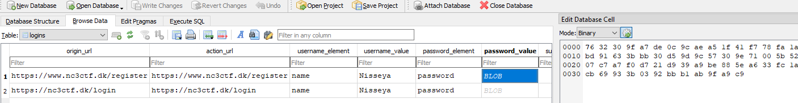
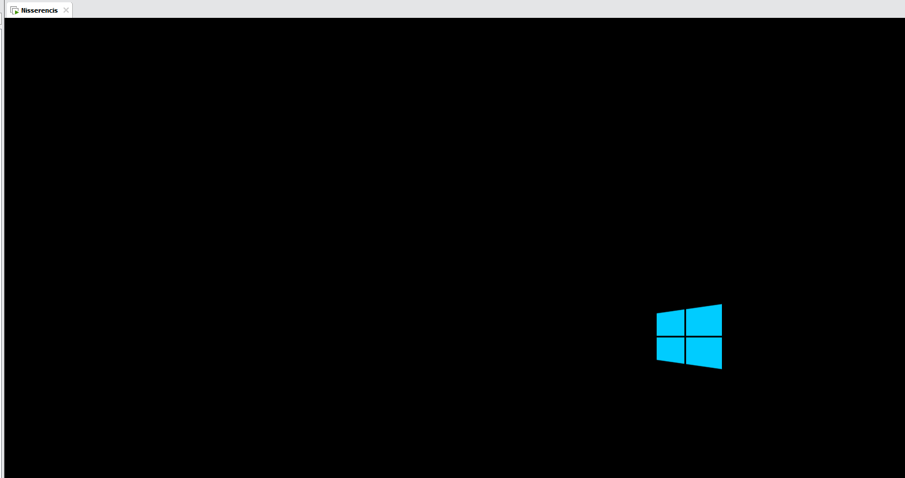
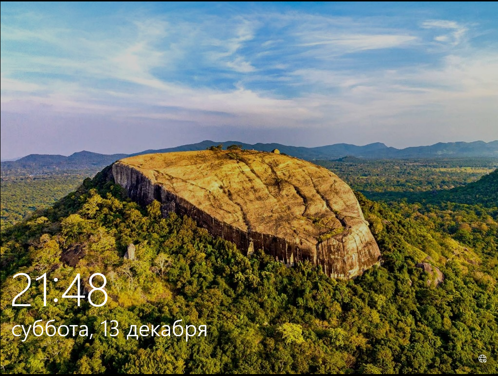
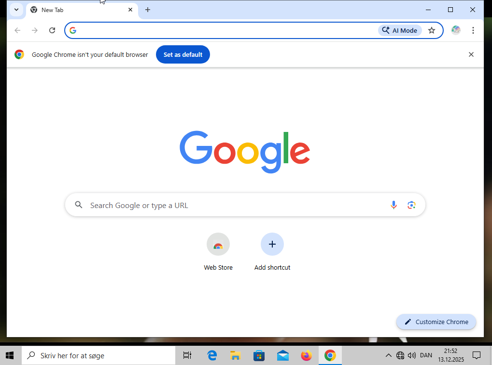

+++
title = 'Nissrensics: Forkromet Mellemgasfordeler'
categories = ['Forensics']
tags = ["CTF", "NC3", "Forensics", "Chrome"]
date = 2025-12-11T21:30:00+01:00
scrollToTop = true
author = "Loff"
+++

## Challenge Name:

 Nissrensics: Forkromet Mellemgasfordeler

## Category:

Forensics

## Challenge Description:
```text
Har lige haft Julemandens kane til mekaniker, han påstår at mellemgaslederen rasler og skal udskiftes - det bliver vist dyrt.

Nå, det kan jeg ikke vurdere, nu vil jeg hjem og spille NC3's jule CTF! Hmm hvad var mit kodeord igen - godt min browser har det forkromede overblik!

OBS: Samme image som i "Nissrensics: Vandrestien"
```
[Nissrensics: Vandrestien](../nissrensics-vandrestien/index.md)

The challenge name (translated) strongly hints at Chrome (“forkromet”), and the description clearly points toward stored browser passwords.

We have already solved a similar challenge involving Firefox’s credential store, so this appears to be the Chrome equivalent, with an extra twist.

## Approach 

The goal is to recover a password saved in Google Chrome on Windows.

The first step is locating Chrome’s credential database and determining whether the password is there, and if stored passwords can be decrypted offline, or whether another approach is required.

On Windows, Chrome stores saved credentials in the following file:

```text
/Users/Nisseya/AppData/Local/Google/Chrome/User Data/Default/Login Data
```

This file is a SQLite database, so I opened it using [DB Browser for SQLite](https://sqlitebrowser.org/) and inspected the logins table:



As expected, multiple credentials related to the CTF were present.
However, the passwords themselves were stored as encrypted blobs.

## Chrome Password Encryption on Windows

Chrome does not store passwords in plaintext. Instead:
* Passwords are encrypted using DPAPI (Windows Data Protection API)
* The encryption key is tied to the Windows user account
* Decryption normally requires:
  * The user’s Windows login context, or
  * Access to Chrome’s derived AES key (newer versions)

## Evolution of Chrome Encryption

Chrome’s encryption has evolved over time:
* Older versions:
  * DPAPI directly encrypts each password
* Newer versions:
  * Chrome derives a master key
  * Passwords are encrypted using AES-GCM
  * The AES key itself is protected by DPAPI

## Identifying the Encryption Version

Extracting the first few bytes from a password entry revealed in hex:

```text
76 32 30
``` 

Which corresponds to:

```text
v20
```

This indicates Chrome v20-style encryption, which is relatively new.

Unfortunately, at the time of solving this challenge: 
* I have found no reliable public tools that fully decrypt Chrome v20 credentials offline
* Even with the Windows password, decryption is non-trivial, due to having multiple steps and involved both user data, Chrome configuration data and DPAPI.

This ruled out a clean offline solution.

## Leveraging Previous Findings

In the [previous challenge (Mørkets Dal)](../nissrensics-mørkets-dal/index.md#additional-information-for-the-next-task) we recovered what strongly appeared to be the Windows password for the user.

If correct, this opens a much simpler path:
Boot the disk image and let Chrome decrypt its own passwords.

## Booting the Disk Image

To do this, I:
* Mounted the disk image as a physical drive using using [Arsenal Image mounter](https://arsenalrecon.com/products/arsenal-image-mounter).
* Created a virtual machine in [VMWare Pro](https://www.vmware.com/products/desktop-hypervisor/workstation-and-fusion).
* Used the mounted image as the VM’s primary hard disk.

The system booted successfully:



The VM presented a Windows login screen. Interestingly with Russian localization:



Using the recovered credentials:

```text
Username: Nisseya
Password: Nichkiya
```

Login was successful.

## Accessing Chrome’s Password Manager

Upon login, Chrome opened automatically, strongly suggesting that booting the image was the intended solution for this challenge.



Navigating to:
```text
Chrome → Passwords and autofill → Google Password Manager
``` 

Chrome prompted for the Windows password (which we already had).


And there it was, the stored credential containing the flag.

## Flag
```text
NC3{Deltager_Nisseya_i_ctfen}
```

## Reflections and Learnings

This challenge highlights several important forensic and security concepts:

* Chrome has caught up security-wise:
 Modern Chrome password encryption (v20) is significantly harder to break offline than Firefox’s.
* Context beats crypto:
 When cryptography becomes impractical, changing perspective like booting the system can be the correct move.
* Excellent challenge chaining:
 The Windows password recovered in a previous task directly enabled this solution. If we had missed it, this one would be a lot harder.
* Real-world realism:
  In real investigations, analysts often log into recovered systems rather than brute-forcing encryption.

Overall, this was a well-designed challenge that reinforces a key forensics lesson:
Sometimes the easiest way to decrypt data is to let the original system do it for you.
