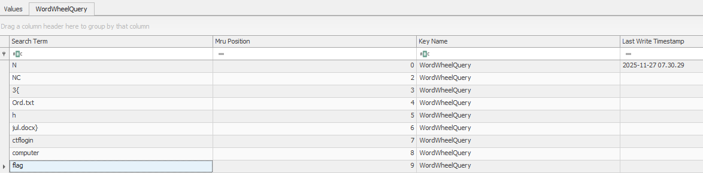

+++
title = 'Nissrensics: Lykke(h)julet'
categories = ['Forensics']
tags = ["CTF", "NC3", "Forensics", "WordWheelQuery", "Windows Registry"]
date = 2025-12-11T21:40:00+01:00
scrollToTop = true
author = "Loff"
+++

## Challenge Name:

Nissrensics: Lykke(h)julet

## Category:

Forensics

## Challenge Description:

```text
Det har været en hård dag, tid til at flade ud i sofaen og se Lykke(h)julet. Det er så sjovt at se deltagerne søge efter bogstaver og sammensætte dem til de rigtige ord!

OBS: Samme image som i "Nissrensics: Vandrestien"
```
[Nissrensics: Vandrestien](../nissrensics-vandrestien/index.md)

Compared to earlier challenges, this description seemed vague to me. The references to searching, letters, assembling words, and hjul (wheel) suggest something related to search history, word fragments, or iterative guesses rather than a concrete file or artifact.

## Approach 

This challenge genuinely stumped me.

Over several days, I exhaustively examined the disk image using both Autopsy and manual tooling, including:

**Browser Artifacts**
* Search history, cookies, credentials, and bookmarks from:
  * Edge
  * Firefox
  * Chrome

**Windows Artifacts**
* Windows Recent Files
* Recycle Bin
* Windows Timeline (via Autopsy)
* Deleted files (carved via Autopsy)
* Jump Lists (AutomaticDestinations)
* Partial document recovery (jul.docx, previously jul.txt, and earlier hjul.txt) found in MFT records
* Keyword searches for Cyrillic characters (due to partial Russian locale)

I repeated much of this analysis both on the live filesystem and within the Volume Shadow Copy recovered in [Mørkets Dal](../nissrensics-mørkets-dal/index.md#exploring-the-shadow-copy)

Despite all this, nothing obvious surfaced.

## The Breakthrough: Recent Documents

Eventually, while reviewing Recent Documents in Autopsy, I noticed an unfamiliar but intriguing entry:


One artifact stood out:

```text
WordWheelQuery
```

That name immediately clicked with the challenge title.

## What is WordWheelQuery?

`WordWheelQuery` is a Windows registry artifact that stores search terms entered into Windows Explorer’s search bar.

Every time a user types something into Explorer search, Windows:
* Stores the query in the registry
* Assigns it an incremental index
* Retains historical searches even if no files were opened

This fits the challenge perfectly:
* Searching for letters
* Trying combinations
* Spinning the “wheel” of guesses

This is not an artifact I've ever encountered before, which was also why the title didn't ring any bells initially.

## Extracting the Artifact

Using Autopsy, I extracted the user’s registry hive:

```text
Users/Nisseya/NTUSER.DAT
```

I then opened it with [Eric Zimmermans Registry Explorer](https://ericzimmerman.github.io/)

Navigating to:

```text
NTUSER.DAT
└── Software
    └── Microsoft
        └── Windows
            └── CurrentVersion
                └── Explorer
                    └── WordWheelQuery

```

## Finding the flag

Inside `WordWheelQuery`, the stored search terms revealed a clear pattern of the flag, being typed as search terms:




## Flag
```text
NC3{Ord.txthjul.docx}
```

## Reflections and Learnings

This challenge was an excellent, and humbling, way to end the Nissrensics series.

* Not all artifacts are files
Some of the most valuable evidence lives entirely in metadata and registries.
* Explorer search history is often overlooked
WordWheelQuery is easy to forget but can reveal user intent, failed attempts, and thought processes.
* Strong thematic design
The challenge text subtly but accurately describes the artifact once you know what to look for.
* Persistence matters
This was not about a clever trick or single command. It was about continuing to look after running out of obvious paths.
* Experience compounds
Prior exposure to Windows forensic artifacts would have drastically shortened the solve time.

As a final challenge, Lykke(h)julet perfectly reinforces the core lesson of the series:
Digital forensics isn’t about finding “the flag”, it’s about understanding how users interact with their systems.