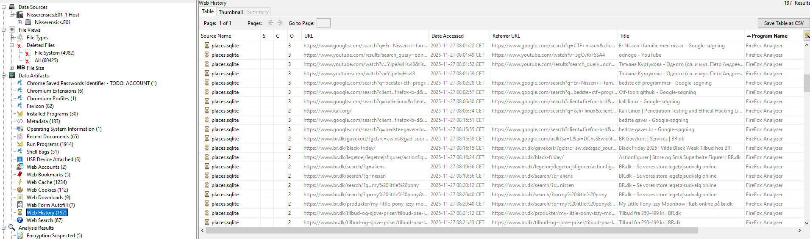

+++
title = 'Nissrensics: Ræv og Nøgler'
categories = ['Forensics']
tags = ["CTF", "NC3", "Forensics", "Firefox"]
date = 2025-12-11T21:10:00+01:00
scrollToTop = true
author = "Loff"
+++

## Challenge Name:

Nissrensics: Ræv og Nøgler 

## Category:

Forensics

## Challenge Description:

```text
Har været på udkig efter julegaver til min nissenevø og kom til at oprette en profil. Nu bliver jeg spammet med reklamer for legetøj, det er seriøst ræv og nøgler.

OBS: Samme image som i Nissrensics: Vandrestien
```
[Nissrensics: Vandrestien](../nissrensics-vandrestien/index.md)

The challenge description strongly hints at browser activity and user profiles, with wordplay around ræv (fox) and nøgler (keys), suggesting Firefox and credential storage.

## Approach 

Continuing our journey through Nisseya’s disk image, this task focuses on identifying a user profile that was created while browsing for Christmas gifts.

Given the hint about foxes and keys, Firefox immediately stood out as the likely attack surface.
We know from the previous task that Firefox was installed and used on the computer
The goal was to determine:
* What the user had been browsing that could be related to this task
* Whether any credentials were saved locally

## Looking through Firefox browse history

Inspecting Firefox’s web history revealed extensive browsing on BR.dk, a major Danish toy retailer:



The browsing pattern shows navigation through multiple toy categories, consistent with shopping behavior. Toward the end of the session history, the activity suggests that a purchase or account interaction occurred, possibly involving a gift card.

Since the challenge title also mentions keys, the next logical step was to investigate whether login credentials were saved.

## Firefox password manager

Compared to Chrome, Firefox’s password manager is relatively permissive:
* If a master password is set, credentials cannot be decrypted without it
* If no master password is configured, stored credentials can be decrypted locally

Given this, I attempted the simple approach first.

I used the well-known Python tool [firefox_decrypt](https://github.com/unode/firefox_decrypt) to extract saved credentials from the Firefox profile.

The relevant Firefox directory was extracted from the disk image:
```text
/Users/Nisseya/AppData/Local/Mozilla
```

After placing it alongside firefox_decrypt, I ran:
```bash
$ py firefox_decrypt.py firefox

Select the Mozilla profile you wish to decrypt
1 -> Profiles/mnstpyk2.default
2 -> Profiles/x8lplqao.default-release
```

The script successfully decrypted the stored credentials:
```bash
Website:   https://nc3ctf.dk
Username: 'Nisseya'
Password: 'megetlangtogsv▒rtkodeord'

Website:   https://www.br.dk
Username: ''
Password: 'NC3{Ildraevens_hemmelighed_brudt}'
```

There are minor encoding issues with the NC3 login password, but this does not affect the outcome.

The important takeaway is that no master password was set, allowing full credential recovery from the local Firefox profile.

## Flag
```text
NC3{Ildraevens_hemmelighed_brudt}
```

## Reflections and Learnings
This challenge highlights several important forensic and security lessons:

* Browser choice matters:
Firefox stores credentials locally in a way that can be decrypted if users do not configure a master password.
* “Keys” aren’t always cryptographic:
Sometimes they are simply stored passwords waiting to be extracted.
* Challenge hints were precise:
“Foxes and keys” directly mapped to Firefox and credential storage, rewarding careful reading.
* Real-world relevance:
This mirrors real incident response scenarios where credential theft occurs via local profile access rather than malware.

Overall, this was a well-designed follow-up challenge that naturally builds on the same disk image while shifting focus from filesystem exploration to user behavior and credential hygiene.