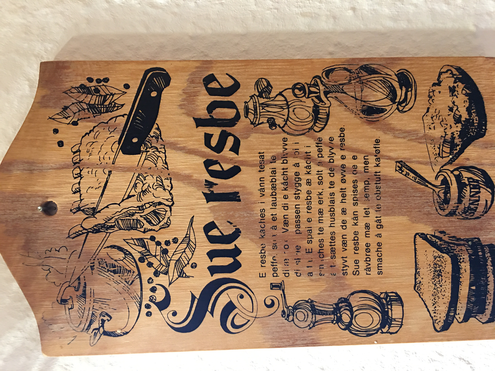

+++
date = "2025-12-01"
title = "Den Bærende Opskrift"
categories = ['Kom godt i gang']
slug = "warmup_den_bærende_opskrift"
tags = ["CTF", "NC3", "Steganography", "Encoding"]
author = "Onero"
+++

## Challenge Name:

Den Bærende Opskrift

## Category:

Kom godt i gang

## Description
I år har vi fået den bærende opskrift fra Julemor. Det bliver 2025 julemaden. Men gemmer opskriften på en hemmelig besked?

The challenge provided a JPEG image named `julemors_opskrift.jpg`. 


The title "Den Bærende Opskrift" (The Carrying Recipe) suggested hidden information within the image or its metadata.

## Recon
I started by analyzing the image metadata using `exiftool`.
```bash
exiftool julemors_opskrift.jpg
```
The output revealed an unusual `XP Comment` field containing a long string starting with `QlpoOTFBWS...`.

## Solution
The prefix `Qlpo` is the standard Base64 encoding of `BZh`, which is the magic header for a **bzip2** compressed file. This indicated the comment field contained Base64-encoded, bzip2-compressed data.

It was then pretty simple to write a [Python script](scripts/solve_recipe.py) to decode and decompress this data:

1.  **Base64 Decode:** Converted the ASCII string back to binary.
2.  **Bzip2 Decompress:** Decompressed the binary data.
3.  **Text Decode:** Decoded the resulting bytes using `latin-1` (ISO-8859-1) to handle the Danish characters correctly.

```bash
[*] Attempting raw file search for 'Qlpo' pattern...
[*] Found UTF-16LE header at offset 2662.
[*] Extracted UTF-16LE string (length 392).
[*] Decoding data...

========================================
DECODED RECIPE CONTENT
========================================
Sue resbe

E resbe kåches i vånn tesat 
peffe, solt å et laubæblai te 
di æ nok. Væn di e kåcht blyvve
di skåe i passen stygge å loi i
a fa. E spai e resbe æ kåcht i 
smaches te mæ erk, solt å peffe
å tesættes husblais te de blyvve
styvt væn de æ helt øvve e resbe.
Sue resbe kån spises oe e
råvbrøe mæ let semp, men
smache å gåt te obstuft ka'tøfle.
NC3{Surrib_er_bedst_på_sønderjydsk}
========================================

[+] FLAG FOUND: NC3{Surrib_er_bedst_på_sønderjydsk}
```

The decompressed text revealed a recipe for "Sue resbe" (Surrib - a Danish dish) written in a Southern Jutland dialect, and at the end, the flag was found.

## Flag
`NC3{Surrib_er_bedst_på_sønderjydsk}`
