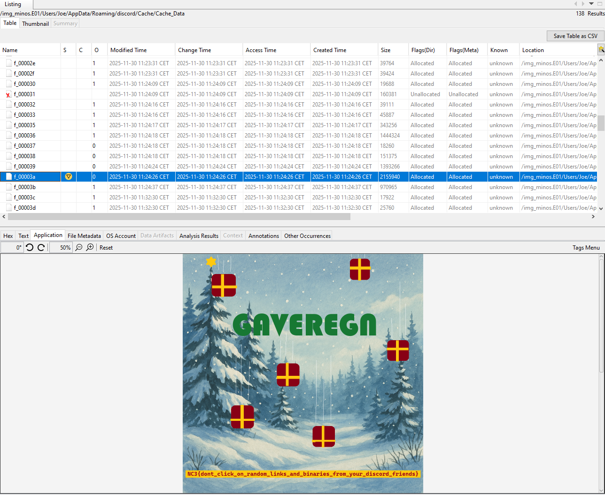
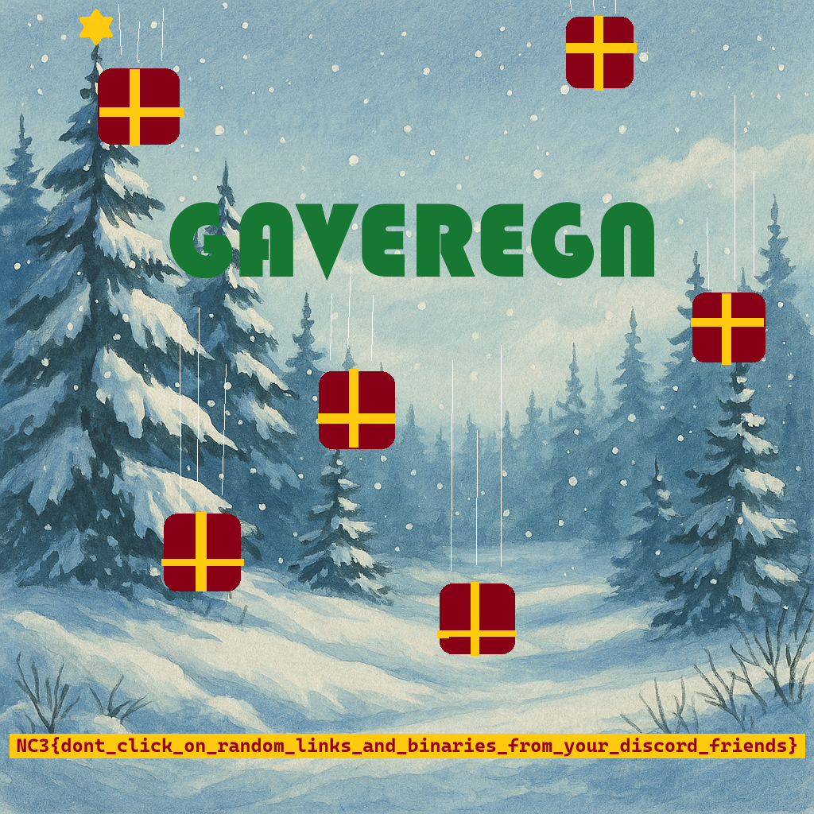
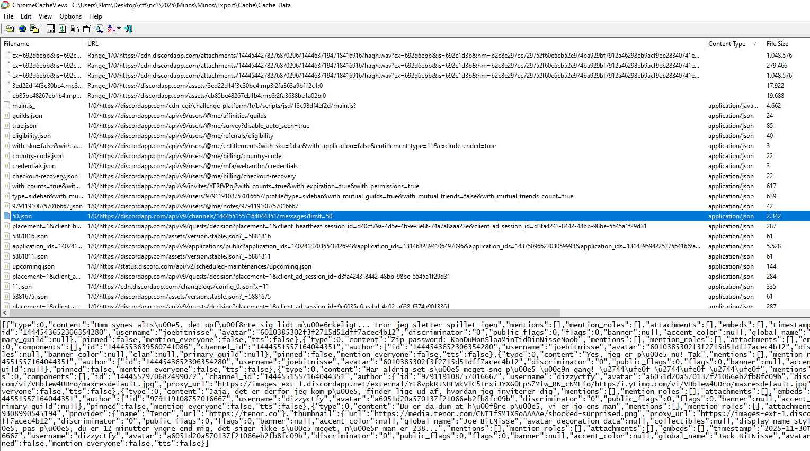

+++
title = 'Minos 1: Initial Access'
categories = ['Malware']
tags = ["CTF", "NC3", "Malware"]
date = 2025-12-12T20:00:00+01:00
scrollToTop = true
author = "Loff"
+++

## Challenge Name:

Minos 1: Initial Access

## Category:

Malware

## Challenge Description:
```text
Vi har modtaget efterretninger om, at BitNisse er blevet ramt af et angreb fra gruppen "Sarpedon" og deres infostealer malware "Minos". Vi har kontaktet virksomheden, der endnu ikke selv var opmærksomme på angrebet.

De havde lagt mærke til, at deres PCer var begyndt at opføre sig lidt underligt, men antog, det måtte være fra en bug i det julespil, de har sendt rundt mellem hinanden for nylig på Discord.

Vi har fået et image af Joe Bitnisses computer til analyse og traffic logs fra BitNisses netværksmonitorering.

Din første opgave er at undersøge, hvordan malwaren oprindeligt kom ind på Joes computer.

⚠️⚠️⚠️
MALWAREN SIMULERER ÆGTE MALWARE,
ANALYSER OG KØR KUN I ET KONTROLLERET MILJØ
⚠️⚠️⚠️

Download

Disk image kan tilgås her: malware_minos.7z
Det er splittet i flere filer, det håndterer 7-zip automatisk.

PCAP fra netværksmonitorering kan downloades herunder
```
[traffic_monitoring.pcapng](handout/traffic_monitoring.pcapng)

The handout for this challenge was a 20 GB Encase disk image, which is not attached here for obvious reasons.

## Approach 

Since we are given a full disk image, the natural starting point is filesystem forensics before diving into the network traffic.

I began by loading the image into [Autopsy](https://www.autopsy.com/) to get an overview of the system and user activity.

The machine is a Windows 10 system belonging to the user Joe.

## Initial observations

On Joe’s Desktop, two files immediately stand out:
* highscores.txt
* metamask.txt.txt

The latter appears to contain a BIP-39 seed phrase, likely for a cryptocurrency wallet. At this stage, it is unclear whether this is:
* The target of the malware
* Something that will become relevant later in the challenge chain

## Suspicious downloads

In Joe’s Downloads folder, several installers are present:
* Firefox installer
* Discord installer
* Gaveregn.zip

Attempting to extract `Gaveregn.zip` triggers Windows Defender, which strongly suggests that this archive contains malicious content.

In Documents, I also noticed the project [Ønskomania 6000](../../../crypto/2025/crypto_ønskomania_6000/index.md), which appears to be a reference to another challenge in the CTF and is likely not directly related to this task.

At this point, Gaveregn.zip is the prime suspect.

## Where did the malware come from?

To identify how `Gaveregn.zip` arrived on the system, I checked Chrome’s browsing history.

The history clearly shows that `Gaveregn.zip` was downloaded via Discord:


This aligns perfectly with the challenge description, which mentions a “julespil” being shared among colleagues on Discord.

## Discord cache analysis

Discord is built using [Electron](https://www.electronjs.org/), which means it relies on Chromium and uses the same caching mechanisms as Chrome.

Discord’s cache is located at:
```text
/Users/Joe/AppData/Roaming/discord/Cache/Cache_Data/
```

The directory contains 234 cache files, making it feasible to quickly skim through them using Autopsy’s built-in viewer.

Among the cache files, I found an image containing the first flag:



Or extracted:


## Understanding the infection chain

While the flag confirms success, this is a multi-stage malware challenge, so understanding the full context is important for future tasks.

Because Discord uses Chromium’s cache format, I extracted the entire Cache_Data directory and analyzed it using [ChromeCacheView](https://www.nirsoft.net/utils/chrome_cache_view.html).

This allows easy browsing of cached responses, images, and JSON payloads.



## Discord chat reconstruction

Besides multiple cached versions of the flag image, one file stood out:
[50.json](files/50.json) (manually formatted for readability)


The reconstructed chat log reveals the full story of the initial compromise:

```text
Jack BitNisse (dizzyctfy):
Hej Joe gamle dreng, er du også kommet på Discord nu?

Jack BitNisse (dizzyctfy):
🎅🏿

Joe BitNisse (joebitnisse):
Så så, pas på, du er 12 minutter yngre end mig, det siger ikke så meget, når man er 238...

Joe BitNisse (joebitnisse):
Har du stjålet mit profilbillede?!?

Joe BitNisse (joebitnisse):
https://tenor.com/view/shocked-surprised-gasp-what-cat-shock-gif-635629308990545194

Jack BitNisse (dizzyctfy):
Du er da dum at høre på, vi er jo ens man

Jack BitNisse (dizzyctfy):
I det mindste ku jeg smile på mit

Jack BitNisse (dizzyctfy):
Har du lavet den arbejdsserver vi snakkede om?

Joe BitNisse (joebitnisse):
Jaja, det er derfor jeg kom på, finder lige ud af, hvordan jeg inviterer dig

Joe BitNisse (joebitnisse):
Kan du huske det her gamle ven? 😂
https://www.youtube.com/watch?v=VHblew4UDro

Jack BitNisse (dizzyctfy):
Haha ja naturligvis, det glemmer jeg aldrig - fantastisk aften!

Jack BitNisse (dizzyctfy):
Har aldrig set så meget sne på én gang! ❄️ ❄️ ❄️

Joe BitNisse (joebitnisse):
https://discord.gg/YFRfVPpj

Joe BitNisse (joebitnisse):
Virkede det?

Jack BitNisse (dizzyctfy):
Yes, jeg er på nu! Tak

Jack BitNisse (dizzyctfy):
Hvad med de andre?

Joe BitNisse (joebitnisse):
Tænker jeg ikke er nødvendigt, det er jo os der har ansvaret for Ønskomat appen til Julle

Jack BitNisse (dizzyctfy):
Zip password: KanDuMonSlaaMinTidDinNisseNoob

Joe BitNisse (joebitnisse):
KanDuMonSlaaMinTidDinNisseNoob??? Hvad er det for et password?

Joe BitNisse (joebitnisse):
Selvfølgelig kan jeg det

Joe BitNisse (joebitnisse):
Hmm synes altså, det opførte sig lidt mærkeligt... tror jeg sletter spillet igen
```

Key Takeaways
* The malware was shared by Jack BitNisse
* It was disguised as a game
* The ZIP file was password-protected
* Joe manually extracted and ran it
* Joe noticed strange behavior shortly afterward

This clearly establishes the initial access vector:
  * A password-protected malicious ZIP file shared via Discord by a trusted contact

## Flag
```text
NC3{dont_click_on_random_links_and_binaries_from_your_discord_friends}
```

## Reflections and learnings

This challenge serves as an excellent introduction to the Minos malware series:
* Clear initial access vector
Social engineering + trusted relationships remain one of the most effective attack methods.

* Cache artifacts are extremely valuable
Browser and Electron caches can reconstruct entire conversations, even when chat logs are no longer accessible.

* Password-protected malware is common
ZIP passwords are frequently used to bypass antivirus scanning during delivery.

* Strong narrative continuity
The challenge ties user behavior, filesystem artifacts, and malware delivery together cleanly.

Most importantly, it reinforces a timeless security lesson:
> Malware doesn’t need exploits if it can convince the user to run it themselves.

## Next up
[Minos 2: Stager](../minos-2-stager/index.md)