+++
title = 'Minos 5: Panel'
categories = ['Malware']
tags = ["CTF", "NC3", "Malware"]
date = 2025-12-12T20:40:00+01:00
scrollToTop = true
author = "Loff"
+++

## Challenge Name:

Minos 5: Panel

## Category:

Malware

## Challenge Description:
```text
Analysen af Jon BitNisses PC har ledt os på sporet af Sarpedons botpanel, hvor alle deres bots leverer stjålne data og kan modtage nye tasks mm. Med forskellige keywords fra sagen, er det lykkedes os at bruteforce passwordet til panelet: EenyMeenyMinosMoe

Log ind på http://<IP>:31742 (den kan godt være lidt sløv i opstarten) og undersøg, om du kan finde måder at læse mere end tiltænkt. Flaget ligger i /root.

OBS: Hele anden del af Minos-serien kan løses fuldstændig uafhængigt af den første.

OBS: Som i det virkelige liv kan du sagtens komme til at ødelægge ting, hvis du ikke er forsigtig. Hvis du ikke kan rette op igen, kan maskinen (modsat i virkeligheden) bare termineres og startes igen på TryHackMe.

https://tryhackme.com/jr/minos 
```

We’re given credentials and an explicit goal: read a file in `/root` from a web panel. The hint “læse mere end tiltænkt” strongly suggests some kind of IDOR/LFI/path traversal style bug.

## Approach 


Since this is a web challenge, I used [Burp Suite](https://portswigger.net/burp) to proxy and manipulate requests.

The site presents a login page. The password is provided in the description:


Password: `EenyMeenyMinosMoe`


After logging in, we land in a bot control panel UI:

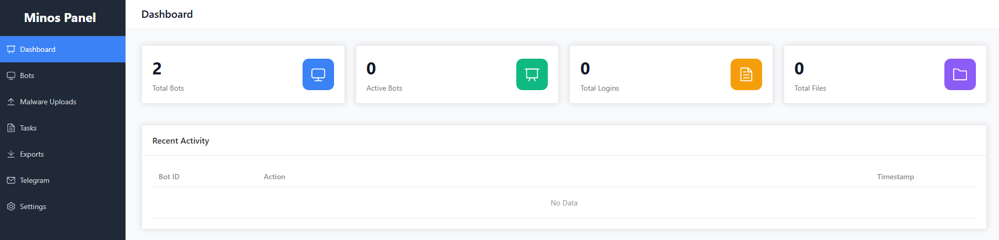

## Recon: Mapping the Functionality

Before poking at endpoints, I clicked through all menu items to understand what the application exposes.

**Bots**

Shows bot list + bot details + export.
(Joe is the bot from task 1-4 in the series)

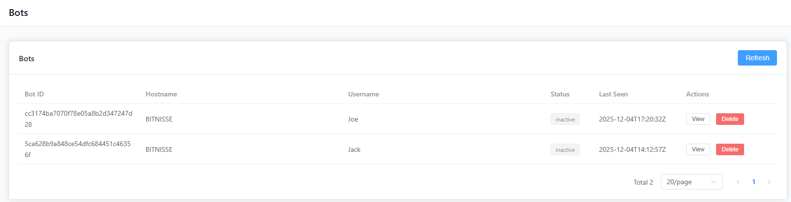

Bot details show stored data and allow export. “View data” appears unimplemented.

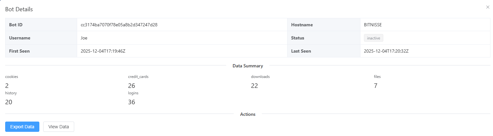


**Malware uploads**

Upload a file (presumably to distribute to bots later), and download it back.

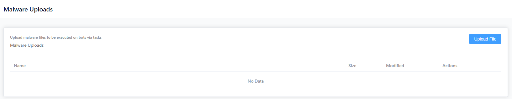


**Tasks**

Create/delete tasks executed by bots.

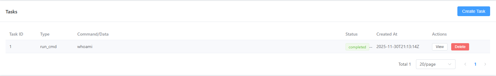

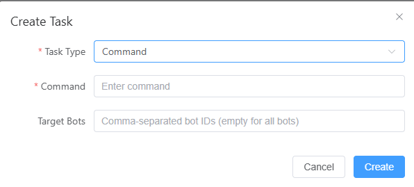

Types of tasks that can be created:


**Exports**

Download/delete exported data from bots (reports and other artifacts).

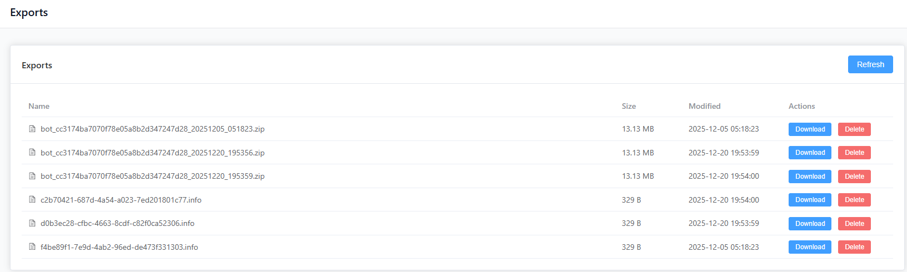


**Telegram**

Configure a Telegram integration.

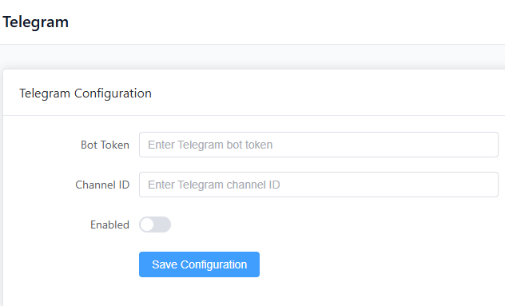


**Settings**

Change admin password and edit server configuration via YAML.

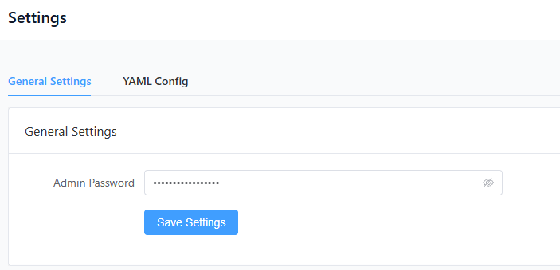

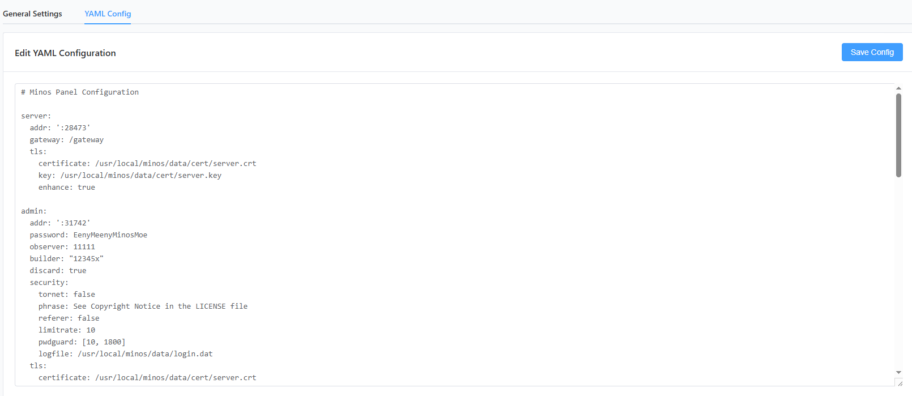

The entire YAML config looks like this: [config.yaml](files/config.yaml)

Pressing `Save Config` pops up a `Config file updated. Service will restart.` alert.

At this point the app clearly supports file upload + file download + config editing, which is a big attack surface.

## Narrowing down the interesting endpoints

In Burp’s HTTP history, after a full browse through the site and pressing all the buttons, I focused on endpoints likely to enable “read more than intended”.

**Candidates**

**Potential SQL injection**
* `POST /api/v2/private/login` - password in request body
* `GET /api/v2/private/bots/cc3174ba7070f78e05a8b2d347247d28` - bot identifier in the path

**Potential file access / path issues**
* `GET /api/v2/private/uploads/download?path=<file>` - After uploading something to the `Malware` page, we can download it again. Filename is a query parameter
* `GET /api/v2/private/downloads/download?path=<file>` - Downloading files on the `Exports` page. Filename is a query parameter

I started from the end, by testing the download endpoint. If the server does not properly restrict paths, this often becomes:
* Path Traversal / Local File Inclusion (`../../..`)
* Reading arbitrary files on disk (including `/root/*`)

## Exploit: Path Traversal via `path=`

I took a legitimate download request from the Exports page and replayed it in Burp Repeater.

Then I replaced the `path` parameter with a file I know exists on the server: `/etc/passwd`:

```text
GET /api/v2/private/downloads/download?path=/etc/passwd
```

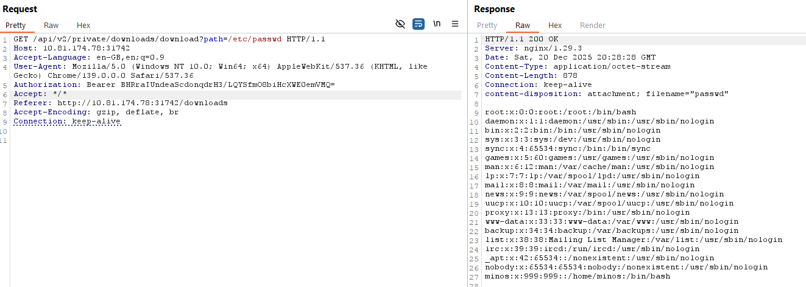

(Authorization is handled via session cookies from the login.)

Which means we can read arbitrary files on the server!

The only thing missing, is the name of the flag.
Because the description explicitly says the flag is in `/root`, the typical guess is:

```text
/root/flag.txt
```

So I tried:

```text
GET /api/v2/private/downloads/download?path=/root/flag.txt
```

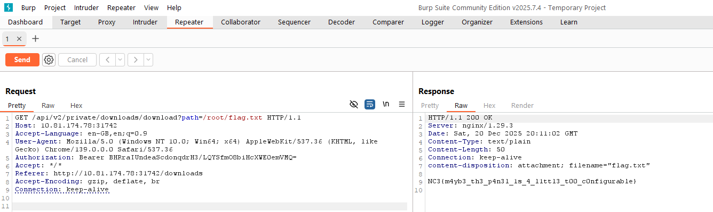

The response returned the flag directly, confirming an arbitrary file read vulnerability via the download endpoint.

## Flag
```text
NC3{m4yb3_th3_p4n3l_1s_4_l1ttl3_t00_c0nfigurable}
```

## Reflections and Learnings
* “Download by path” is a classic footgun: Any endpoint that accepts a filename/path from the client must enforce strict allow-listing (e.g., UUID-only) and resolve to a safe base directory.
* Auth doesn’t save you from authorization bugs: Even though the endpoint was “private” and required login, it still allowed reading arbitrary sensitive files.
* UI recon pays off: Clicking through the app first made it easy to identify the most dangerous features (uploads/downloads/config).
* Over-configurability is an attack surface: Admin settings + YAML config + file operations is exactly the kind of “real malware panel” feature creep that creates security gaps.

## Up next

Series continues in [Minos 6: Server](../minos-6-server/index.md)