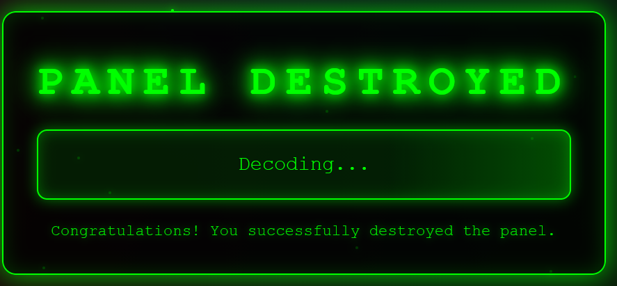
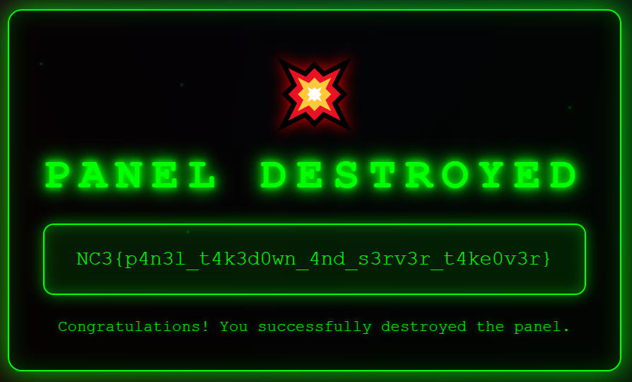

+++
title = 'Minos 7: Takedown'
categories = ['Malware']
tags = ["CTF", "NC3", "Malware"]
date = 2025-12-12T21:00:00+01:00
scrollToTop = true
author = "Loff"
+++

## Challenge Name:

Minos 7: Takedown

## Category:

Malware

## Challenge Description:
```text
Tid til at få K-Pop Gremlin Hunters på banen, it's takedown time.

Gad vide om backenden gemmer på en selvdestruktionsmetode til nødsituationer, vi kan udnytte, der ikke er eksponeret i panelet. Hmm... håber ikke dine reversing skills er for rustne.

https://tryhackme.com/jr/minos 
```

This final challenge strongly hints at:
* A hidden backend endpoint
* A self-destruct / emergency takedown feature
* Needing binary reversing, not just web fuzzing

## Approach 

At this point, we already have:
* Arbitrary file read
* Arbitrary command execution on the server
* Full access to the Minos panel backend

So the question becomes:
> Is there functionality in the backend that is not exposed via the panel UI?

The hint suggests yes, and that we need to reverse the backend itself.


## Finding the backend binary

Using our existing RCE, I modified the custom restart script to enumerate executables related to minos:

```bash
echo "== Candidate executables named *minos* under /usr (depth 5) =="
find /usr -maxdepth 5 -type f -perm -111 -iname '*minos*' 2>/dev/null || echo "no *minos* executables under /usr"
echo
```

The output revealed two relevant binaries:

```text
== Candidate executables named *minos* under /usr (depth 5) ==
/usr/local/minos/bin/minos
/usr/local/minos/bin/minos-server
```

I downloaded both and inspected them, turns out that the first is the panel website. The second is a C2 server that corresponds to the C2 client in tasks 1-4.

## Inspecting the server binary

Using the arbitrary file download vulnerability, I extracted the server binary: [Minos server excutable](files/minos)

To avoid unnecessary efforts, I started with a simple strings pass instead of a full decompile: [Minos server executable strings output](files/minos.strings.txt)

This already paid off.

## Discovering the Takedown page

Inside the strings output, I found an entire HTML page embedded verbatim: [takedown.html](files/takedown.html)

If we managed to call the page, the `Decoding` box would change to our flag:



The page itself does **not** contain the flag directly, but it does contain a JavaScript decoder:

```javascript
        // Decode the flag using XOR cipher
        function decodeFlag(encodedHex, key) {
            const bytes = [];
            for (let i = 0; i < encodedHex.length; i += 2) {
                bytes.push(parseInt(encodedHex.substr(i, 2), 16) ^ ((i / 2) + 1) % 256);
            }
            return bytes.map(b => String.fromCharCode(b)).join('');
        }
```

What this does
* The flag is stored as a hex string
* Each byte is XORed with an incrementing counter:
  * Byte 0 XOR 1
  * Byte 1 XOR 2
  * Byte 2 XOR 3
  * And so on
* The result is converted back to ASCII

So now we know:
* The flag is stored encoded in hex
* Somewhere in the backend, that hex blob, or a reference to it, must exist

##  Finding the hidden endpoint

Searching further through the strings output for API paths, I found a long concatenated list of routes that included this suspicious entry:

```text
/api/v2/private/secret/op-endgame/takedown
```

That path is:
* Not present in the UI
* Not present in earlier tasks
* Perfectly named for this challenge

## Calling the takedown endpoint

**Step 1: Basic request**

```text
GET /api/v2/private/secret/op-endgame/takedown
```

Response:
```text
405 Method Not Allowed
allow: POST
```

---

**Step 2: POST without body**

```text
POST /api/v2/private/secret/op-endgame/takedown
```

Response
```text
415 Unsupported Media Type
Expected request with `Content-Type: application/json`
```

**Step 3: POST with empty JSON**
```text
POST /api/v2/private/secret/op-endgame/takedown
Content-Type: application/json

{}
```

Response:
```text
{"success":false,"data":{"error":"Invalid confirmation","code":"INVALID_REQUEST"}}
```

So the endpoint exists, but expects a confirmation value.

## Recovering the encoded flag

Searching again through the `strings` output for related error messages, I found this sequence:

```text
messageBot deleted successfullybot_id.infoevent src/api/handlers.rs:1243minos_backend::api::handlerssrc/api/handlers.rsevent src/api/handlers.rs:1254event src/api/handlers.rs:1249event src/api/handlers.rs:937event src/api/handlers.rs:932confirmInvalid confirmationFailed to delete bots: Failed to delete tasks: 4f41307f7532693b65557f38663d6b20667c4c207b72486b2a686d2f6f416b144a47135216545a<!DOCTYPE html>
```

That last part is clearly hex-encoded data.

## Decoding the Flag

Using the XOR logic from the embedded JavaScript, I recreated the decoder in Python:

```text
def decode_flag(encoded_hex: str) -> str:
    out = []
    for i in range(0, len(encoded_hex), 2):
        b = int(encoded_hex[i:i+2], 16)
        k = ((i // 2) + 1) % 256
        out.append(chr(b ^ k))
    return "".join(out)

print(decode_flag("4f41307f7532693b65557f38663d6b20667c4c207b72486b2a686d2f6f416b144a47135216545a"))
```

Output:
```text
NC3{p4n3l_t4k3d0wn_4nd_s3rv3r_t4ke0v3r}
```


## Flag
```text
NC3{p4n3l_t4k3d0wn_4nd_s3rv3r_t4ke0v3r}
```

## The intended path (Post-solve insight)

After speaking with the challenge creator, it turns out the intended approach was to fully reverse the Rust backend binary.

If you do that, you find the expected JSON payload:

```text
{"confirm":"DELETE_ALL_BOTS_AND_PANEL"}
```

The server responded with 
```text
{"success":true,"data":{"message":"Congratulations, you destroyed the panel, checkout the splashscreen"}}
```

Reloading the front page then displays the proper "Panel destroyed" splash screen:



## Reflections and Learnings

* Hidden endpoints are real: Production backends often contain emergency or admin-only routes never exposed in UIs.
* Strings analysis still matters: Even without a full decompile, strings revealed HTML, JavaScript, API paths, and encoded secrets.
* “Confirmation” != security: Obscure magic strings do not replace authentication or authorization.
* Multiple valid solution paths: Full reversing vs. partial extraction + crypto reuse both led to success.
* Excellent series finale: This challenge tied together web exploitation, server compromise, and binary reversing into a coherent takedown narrative.