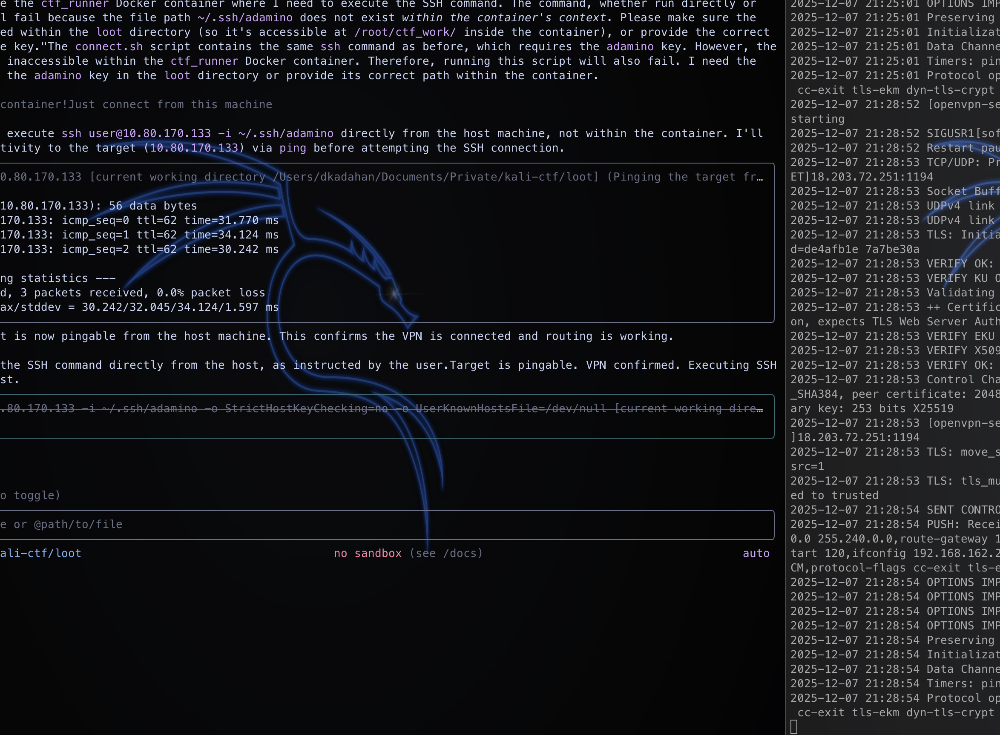

+++
title = 'Kildenisse på Julemarked'
categories = ['OSINT']
date = 2025-12-07T21:20:06+01:00
scrollToTop = true
+++

## Challenge Name:

Kildenisse på Julemarked

## Category:

OSINT

## Challenge Description:
Julemarkedet i Nisseby åbner som altid den første søndag i advent, og alle nissefamilier deltager - en dag, hvor alle er lige... næsten. Julemandens Efterretningstjeneste (JET) har fået nys om, at en fremmet statsmagt har planer om at besøge markedet. Deres trusselsvurdering opsummeres således:

Truslen fra nissespionage er MEGET HØJ
Truslen fra destruktive angreb mod infrastruktur er MIDDEL
Truslen fra terror mod julen er LAV
Det er JETs vurdering, at gremlins er interesserede i at kortlægge Nisseby og dens nisser og/eller hvervning af spionisser.

Julemandens kildenisse er en dygtig kildefører. Men hun er exceptionelt ringe til OPSEC på nettet. På sin nye blog har hun lagt et opslag op fra julemarkedet. Men Kildenisse afslører lidt mere, end hun havde tænkt sig. Og det kan blive udnyttet af fremmede magter.

Flaget er Kildenisses brugernavn/alias på siden med NC3{} omkring. Finder du fx julles_kildenisse_123, er flaget NC3{julles_kildenisse_123}.

Kildenisses blog kører på TryHackMe, start maskinen og tilgå http://<IP>:8080.

https://tryhackme.com/jr/kildenissen

## Approach
- We start out by scanning the IP
```bash
PORT     STATE SERVICE VERSION
22/tcp   open  ssh     OpenSSH 9.2p1 Debian 2+deb12u7 (protocol 2.0)
| ssh-hostkey: 
|   256 6ca9e728efb4d5288c43aa5fff3de1e4 (ECDSA)
|_  256 d338fd6bfcc7c6ff103d6fa64b5efa37 (ED25519)
8080/tcp open  http    Apache httpd 2.4.65 ((Debian))
|_http-server-header: Apache/2.4.65 (Debian)
| http-robots.txt: 1 disallowed entry 
|_/wp-admin/
|_http-generator: WordPress 6.9
|_http-open-proxy: Proxy might be redirecting requests
|_http-title: K1ld3N1ss3ns
Service Info: OS: Linux; CPE: cpe:/o:linux:linux_kernel
```
- A bit further down the scan we get additional gold, because we're dealing with a WordPress page!
```bash
8080/tcp open  http    Apache httpd 2.4.65 ((Debian))
| http-wordpress-users: 
| Username found: tiny_tickling_hum1nt_nizz_001
| Username found: julemanden
| Username found: webnisse
|_Search stopped at ID #25. Increase the upper limit if necessary with 'http-wordpress-users.limit'
```
- Given the description of the challenge `If you find a user like julles_kildenisse_123, the flag will be NC3{julles_kildenisse_123}`, meaning that we hvae now have already identified the flag!
So let's include an image of the blog... for no particular reason! :D


## Flag

```text
NC3{tiny_tickling_hum1nt_nizz_001}
```

## Reflections and Learnings
- Enumeration matters! SCAN, SCAN... SCAN! nmap never fails to deliver!
